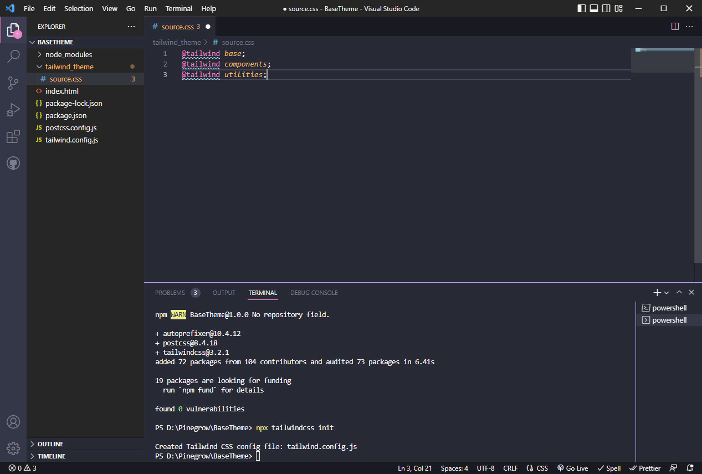

# How to create a basic Tailwind site

This tutorial will walk you through the basics of creating a simple website with a single page that utilises Tailwind CSS. The code that makes up this tutorial is available as a separate download and it can form the base for a Pinegrow project.

I would like to take the opportunity of thanking Adam Lowe of [Peak Performance Digital](https://peakperformancedigital.com/) for his time in proof reading the original of this and making some very pertinent suggestions as to how to do all this properly.

We'll be using Visual Studio Code to create our base project.  If you don't have a copy of it you can [download it from here](https://code.visualstudio.com/download).

Once you have Visual Studio Code installed(herein and after referred to as VSCode)  you're also going to need to install Node JS which you can [get from here](https://nodejs.org/en/download/). Select the version that best suits your operating system and it probably makes more sense to opt for the LTS version rather than the latest version.

At a location of your choice on your computer create a new folder called BaseTheme.

---
**NOTE**

Do Not have any spaces in your folder name as this can cause issues later on when importing this into Pinegrow.

___

Open VSCode and then within that open your newly created folder.  Once open go to the Terminal menu in VSCode and then click New Terminal. A terminal (command) window will open up at the bottom of the editing window.


The first task is to creat a Package .Json file.  At the command prompt type in the following command.

`npm init -y`


Having done that we can now install Tailwind CSS.  In addition to that we'll also add PostCSS and Autoprefixer.  At the command prompt type the following.

`npm install -D tailwindcss postcss autoprefixer`  

The project should now look like this.


The next step is to add the Tailwind configuration file.  At the command prompt type the following.

`npx tailwindcss init `

You should now see the tailwind.config.js file in your project.


Let's take a little time to consider this file.

```js
/** @type {import('tailwindcss').Config} */
module.exports = {
  content: [],
  theme: {
    extend: {},
  },
  plugins: [],
}
```

Essentially this file dictates what html or javascript in our project will be examined through statements added to the content section.

Additional extensions that are made to Tailwind are added to the extend section and any additional plugins that may need to be referenced are noted in the plugin section.

We now need to add a file to configure the PostCSS tool.  Add a new file called postcss.config.js to your project and the add the following code to it.

```js
module.exports = {
  plugins: {
    tailwindcss: {},
    autoprefixer: {},
  }
}
```

Your project should now look like this.


The next task is to add an index.html file to our project.  Create the new index.html file and then add the following code to it.

```html
<!doctype html>
<html>
<head>
  <meta charset="UTF-8">
  <meta name="viewport" content="width=device-width, initial-scale=1.0">
</head>
<body>
  <h1 class="text-3xl font-bold underline">
    Hello world!
  </h1>
</body>
</html>
```

The project should now look like this.


Now we are going to add a new folder to the project to contain our source and compiled CSS files.  

---
**Tip**

With an eye to the future use of this project as a basic template for use in Pinegrow name this new folder tailwind_theme

___

Into our new folder we'll add a new file called source.css which will act as our source of truth for Tailwind CSS.  Add the following code to that file.

```css
@tailwind base;
@tailwind components;
@tailwind utilities;
```

Your project should now look like this.



We've almost completed our BaseTheme template.  We need to tell the html file where to read its css from, we need to tell the tailwind cinfiguration what files it needs to look at and we need to add an instruction into the package configuration that provides the instruction for putting those bits of tailwind css that are used in out files into a final production ready css file.


Open up the tailwind.config.js file and amend the content section.

```js
/** @type {import('tailwindcss').Config} */
module.exports = {
  content: ["./*.{html,js}"],
  theme: {
    extend: {},
  },
  plugins: [],
}
```

Open up the package.json file and amend the "scripts" section.

```json
{
  "name": "BaseTheme",
  "version": "1.0.0",
  "description": "",
  "main": "index.js",
  "scripts": {
    "dev": "npx tailwindcss -i ./tailwind_theme/source.css  -o ./tailwind_theme/tailwind.css  --watch"
  },
  "keywords": [],
  "author": "",
  "license": "ISC",
  "devDependencies": {
    "autoprefixer": "^10.4.12",
    "postcss": "^8.4.18",
    "tailwindcss": "^3.2.1"
  }
}
```

The line we have just added is essentially telling Tailwind the the main source of truth (all of the tailwind classes) can be derived from the source.css file in the tailwind_theme folder.  Aftere processing the files we want processed (ad listed in the content section of the tailwind config file) output the required tailwind css classes to a new tailwind.css file in the tailwind_thene folder.


Finally open up the index.html file and amend the head section to provide instructions as to where to find the css.

```html
<!doctype html>
<html>
<head>
  <meta charset="UTF-8">
  <meta name="viewport" content="width=device-width, initial-scale=1.0">
  <link href="/tailwind_theme/tailwind.css" rel = "stylesheet">
</head>
<body>
  <h1 class="text-3xl font-bold underline">
    Hello world!
  </h1>
</body>
</html>
```

Ensure that all of the files in your project have been saved.

Now return to the command prompt and type in the following

```npx tailwindcss -i ./tailwind_theme/source.css  -o ./tailwind_theme/tailwind.css  --watch```

If everything goes to plan and you haven't deviated from these instructions you should see a new tailwind.css file appear in the tailwind_theme folder.


That completes the BaseTheme creation.  This project can now be used as a basic starter template for a new Pinegrow project.

You can make use of this project by downloading the code from the relevant [GitHub repository](https://github.com/domsinclair/BaseTheme).