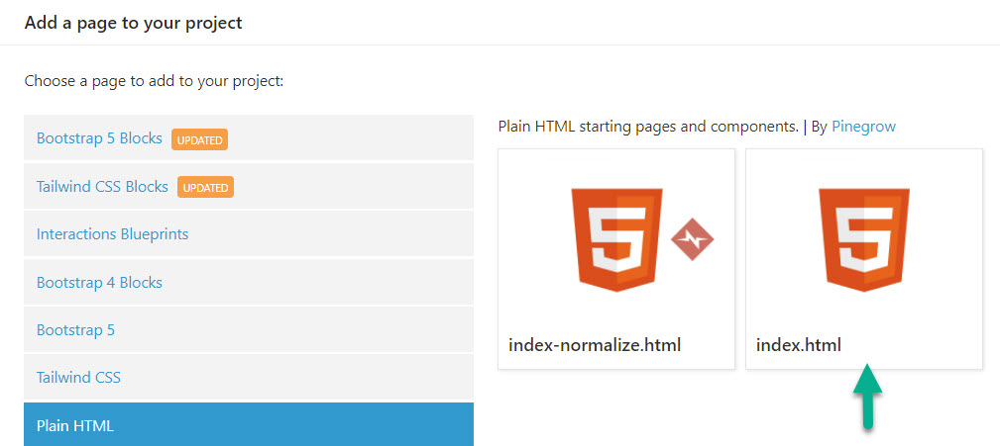
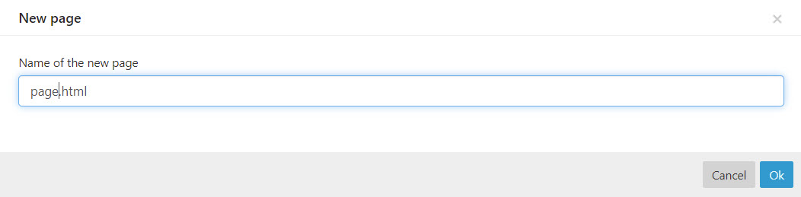
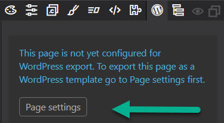
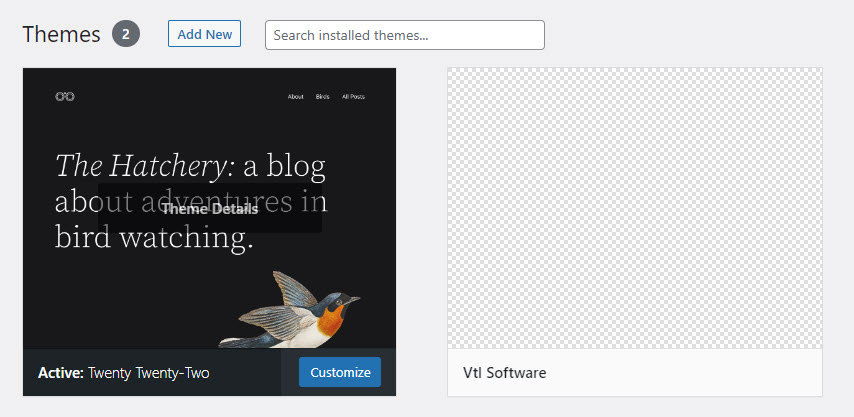
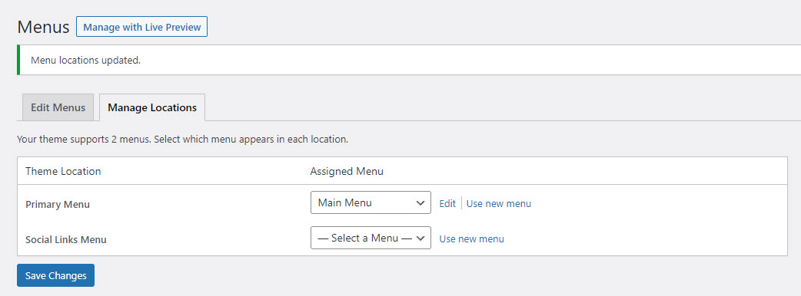
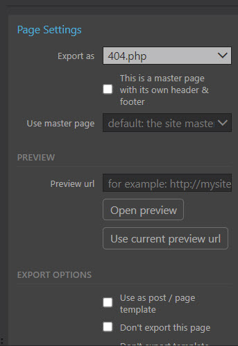
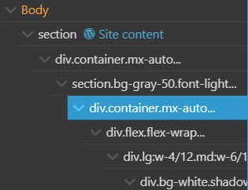
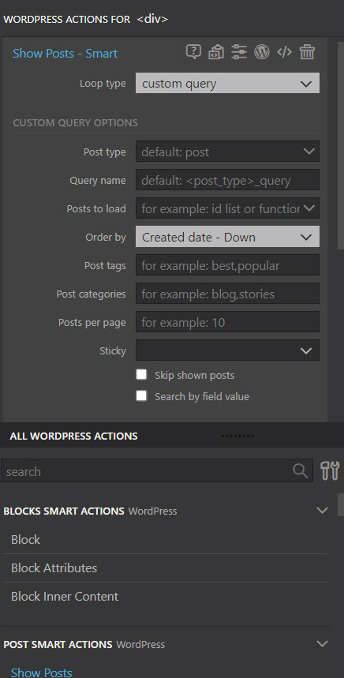
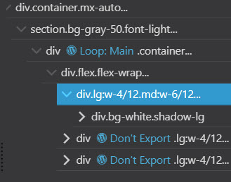
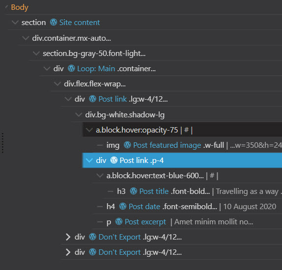

# Creating a basic WordPress theme using Pinegrow

- [Creating a basic WordPress theme using Pinegrow](#creating-a-basic-wordpress-theme-using-pinegrow)
  - [Getting Started](#getting-started)
    - [Creating a local WordPress site](#creating-a-local-wordpress-site)
    - [Configure Pinegrow for WordPress](#configure-pinegrow-for-wordpress)
    - [Adding the basics to our theme](#adding-the-basics-to-our-theme)
  - [The Main Catch All Template (index.php)](#the-main-catch-all-template-indexphp)
    - [Using Pinegrow](#using-pinegrow)
    - [Creating the index.html page](#creating-the-indexhtml-page)
    - [Creating the page.html page](#creating-the-pagehtml-page)
  - [Adding the new theme to the WordPress site](#adding-the-new-theme-to-the-wordpress-site)
  - [Completing the basic WordPress templates](#completing-the-basic-wordpress-templates)
    - [Single php](#single-php)
    - [404 php](#404-php)
    - [Home php](#home-php)
  - [Conclusion](#conclusion)

This tutorial is aimed at those people who generally create websites based on the WordPress CRM and especially for those who have generally used specific WordPress page builders to accomplish that task.

This tutorial is going to use the BaseTheme that we developed and then imported into Pinegrow as our staring point. If you haven't read those yet then it will help your understanding of what is to follow if you do so now.

[How to create a basic Tailwind site](basicsite.md)

[How to setup a Pinegrow Project from the basic tailwind site](pgbasictemplate.md)

Whilst the tasks involved are actually relatively straight forward the subject matter needs to be understood. Conventional Page Builders abstract away a lot of the mechanics about how WordPress sites actually work. If you are going to be a proficient WordPress site creator using Pinegrow then you will need to develop a sound understanding of these principles. Whilst this tutorial will try and address this it should not be seen as a single source of truth on the matter.

## Getting Started

### Creating a local WordPress site

Before we get started there is one task that we need to do. We are going to need a local WordPress site on our development machine for testing purposes.

---

**NOTE**

When the new Pinegrow WordPress plugin is released this step will not be strictly necessary. If you are using the desktop version though it is.

---

For this task we're going to use [Local](https://localwp.com/). Download and install the program. Once you have done that open it and create a new site. It's a relatively straight forward procedure. You can customise the site that is created choosing the version of PHP required, the server type it will be run on and the version of MySql for the database. It makes sense to try and replicate the settings that are available obn the final hosting domain.

### Configure Pinegrow for WordPress

Open up Pinegrow and the open up the project that was created in the second tutorial. Once open, open up the index.html file. Clear out the content with the body section so that the actual html looks like this;

```html
<!DOCTYPE html>
<html>
  <head>
    <meta charset="UTF-8" />
    <meta name="viewport" content="width=device-width, initial-scale=1.0" />
    <link href="tailwind_theme/tailwind.css" rel="stylesheet" type="text/css" />
  </head>
  <body></body>
</html>
```

When creating content for WordPress Pinegrow lets you build Themes or Plugins. To begin with we are going to create a theme. There's no need to feel daunted by this, Pinegrow is going to do almost all of the work for you. Concentrate instead on what it's doing, and how this relates to the way that WordPress websites need to be built.

In Pinegrow click on the WordPress icon to open the WordPress tool panel and click the Activate WordPress button.


You will now see the following dialog


There are a number of options in this dialog but for the time being we really only need to fill in the three required fields as we will keep the default Project Type of Theme as is;


The theme folder is the folder that contains the WordPress themes in the new local site we created earlier.


---

**NOTE**

You will need to create a specific folder to hold your newly created theme files.

---

Save the settings, then from the WordPress menu Export the theme.

Navigate to your newly created theme folder and look at what Pinegrow has just created for you.


### Adding the basics to our theme

There is a wealth of documentation on WordPress themes in the official [WordPress Developer Documentation](https://developer.wordpress.org/themes/). This can seem a daunting read, especially to anyone not familiar with the intricacies of writing code and especially to those WordPress developers who have only ever used Page Builders. However the fundamentals are not that complicated to understand and we'll see that Pinegrow has already got us off to a good start.

Typically one of the first things that you'd do would be to create templates which would be used to render content. On first glance there is no obvious way to do this in Pinegrow, however Pinegrow works with WordPress as defined by its documentation.

Before we continue consider this image from the WordPress documentation.


What is being depicted here is a visual representation of the WordPress template hierarchy. Working from left to right we see the basic page types that we find on a typical WordPress site. The diagram demonstrates how these page types are rendered by a series of secondary, variable and finally primary templates. On the far right, acting as a catch all for everything is the index.php template. In essence the index.php template is what a tradition page builder might describe as a Main or Master template.

---

**NOTE**

WordPress templates are php files.

---

Look back at the WordPress settings images above and notice that the Master Page by default had been set to the index.html file and if you then look at the files that were added to our new theme directory in the local site you'll see that we already have an index.php file created for us by Pinegrow.

## The Main Catch All Template (index.php)

We'll now set about adding some content to our index.html page and in the process create what will become the master template for our new wordpress theme. Before we get started on that we need to take some time to give newcomers to Pinegrow some basic information on how to get things done.

### Using Pinegrow

This is not going to be an exhaustive dissertation on how to use Pinegrow, for that [see the documentation](https://pinegrow.com/docs/getting-started/), rather this will act as a brief introduction to those bits that you need to familiarise yourself with.


On the left hand side of the main screen click on the Library icon to open the Library panel, do the same on the right hand side with the structure panel.

Pinegrow is essentially an html editor so the first thing that you'll see in the library is a comprehensive list of all the possible html tags that you can place on your pages. If you're familiar with html this may be all that you need to get started. Html tags can be dragged from the library onto the main surface of your page and those will inturn appear in the newly opened structure panel on the right.

For many users of page builders this may seem a little too basic as they have been used to dragging ready made components onto pages / templates that they are creating. Pinegrow can help you there as it has a series of ready made blocks to get you started. In the library panel click on the Blocks tab.


Take some time to scroll through some of the ready made items that Pinegrow have provided to use with Tailwind CSS.

---

**NOTE**

There are a number of pre-built components for Tailwind that can be found all over the internet. Below are just a couple of good examples.

TailwindCSS themselves make a comprehensive set [TailwindUI](https://tailwindui.com/components). These are paid for components. <br>
[Flowbite](https://flowbite.com/) Both free and paid for components.

---

### Creating the index.html page

To keep things simple for the moment we'll use the pre-designed blocks that Pinegrow have provided.

From the blocks tab in the library select the Headers section and find the Fullwidth menu, It's not the most spectacular header design wise but it will do for what we require. Drag it to your page and you'll have a header section at the top.

Next up we are going to need a footer section. From the blocks find the footers and drag Footer Block 2 onto the page.

The page should now look like this


We have a header at the top and a footer at the bottom. Now all we need is something in the middle to act as a container for the rest of the templates we will create.

Return to the list section of the Library. Find the sections section and from there drag a section tag into the structure tree to sit between the header and footer. With the section still selected open the WordPress panel and scroll down through the WordPress actions until you find Site Content. Select that.

In the structure tree locate the div in the header section that contains the menu items. Add a WordPress Menu action to it.

Now save the page and Export the theme.

### Creating the page.html page

If you refer back to the visual diagram of the WordPress template layout from earlier you'll see that single blog posts and pages get displayed via the page.php template.

In the project panel click on the little drop down arrow next to the project name and from the drop down menu select Add a new Page. From the dialog that pops up select plain html and then select index.html.



You'll be asked to name the new page and for the name.



Now open up the page.html and its code. Replave the link tag in the head section with the same link as exists in your index.html so that it can reference the Tailwind stylesheet.

```html
<!DOCTYPE html>
<html lang="en">
  <head>
    <meta charset="utf-8" />
    <meta http-equiv="X-UA-Compatible" content="IE=edge" />
    <meta name="viewport" content="width=device-width, initial-scale=1" />
    <meta name="description" content="" />
    <meta name="author" content="" />
    <title>New page</title>
    <link href="tailwind_theme/tailwind.css" rel="stylesheet" type="text/css" />
  </head>
  <body></body>
</html>
```

Open the WordPress panel and click the Page Settings button. This will ensure that the page / template gets added to your WordPress Theme. There is no need to alter any of the default Page Settings.



Just two more small jobs to complete the job.

Add a section to the page from the library and once it is in place apply the WordPress Site Content action to it (found in the WordPress Panel).

To that section add a div and set the WordPress Post Content action to it.

Your page,html code should now resemble this.

```html
<!DOCTYPE html>
<html lang="en" wp-template>
  <head>
    <meta charset="utf-8" />
    <meta http-equiv="X-UA-Compatible" content="IE=edge" />
    <meta name="viewport" content="width=device-width, initial-scale=1" />
    <meta name="description" content="" />
    <meta name="author" content="" />
    <title>New page</title>
    <link href="tailwind_theme/tailwind.css" rel="stylesheet" type="text/css" />
  </head>
  <body>
    <section wp-site-content>
      <div class="container mx-auto p-4" cms-post-content></div>
    </section>
  </body>
</html>
```

Notice on the div that we have applied the Tailwind container class which effectively causes the div to be full width. We've also added left/right margin of auto and padding all round.

## Adding the new theme to the WordPress site

Now that we have a very basic theme ready it's time to try it out in WordPress itself.

Open up your local WordPress site. Carry out the following tasks.

1. Go to the Plugins page. Delete Akismet and Hello Dolly plugins
2. Add the Faker Press plugin to the site.
3. Create a few fake posts using Faker Press.
4. Create a new page, call it Home, add some basic content and publish.
5. Activate your new theme, you'll find it's already listed in the themes section.



Create a new menu, add your new Home page to it and one of your faked posts.
Make sure that you set the location of your new menu on the Manage Locations Tab. This will ensure that Pinegrow's smart action for the WordPress menu can take effect.



Open up you site on the front end and observe that your theme is now active , the menu is set to the menu you created amd clicking the Home item will display the Home page.

## Completing the basic WordPress templates

We have a few more basic templates to complete in order to meet the basic requirements for a WordPress site. Before we continue you may find it helpful to reference this [Pinegrow Documentation Article](https://pinegrow.com/docs/wordpress/a-short-guide-to-wordpress-template-names/) which talks about the names you may wish to apply to your templates and why. We could do with one to display single posts (single.php), one to act as a blog archive (archive.php) and one to cover errors as in page/post not found (404.php)

### Single php

This is the easiest one to create as we can just replicate the page.html. In the project panel right click on page.html and from the context menu select duplicate. Enter single.html when prompted for a name.

Save the file and export the theme. Open the local site and click on the post menu item you created. The post is shown but it's hardly inspiring in terms of style. Let's correct that.

Open the tailwind.config.js file and amend the exports section so that it looks like this.

```js
module.exports = {
  content: [
    "./_pginfo/**/*.{html,js,css}",
    "./*.{html,js,css}",
    "./inc/**/*.{html,js,css}",
  ],
  theme: {
    extend: {
      colors: pg_colors, //<-- Use the pg_colors for colors
      fontFamily: pg_fonts, //<-- Use the pg_fonts for fonts
    },
  },
  plugins: [require("@tailwindcss/typography")],
};
```

To ensure that your posts get some styling amend the div in the section and add two additional tailwind classes to it.

```html
<section wp-site-content>
  <div class="container mx-auto p-4 prose prose-lg" cms-post-content></div>
</section>
```

This makes use of Tailwinds typography class. Save and export the theme and look again at your post, its appearance has been greatly improved.

### 404 php

This too is relatively easy to do. Once again duplicate the page.html and this time when prompted for the name enter page-404.html (html pages can't have names that start with numbers).

Amend the html for the page to resemble what we have below.

```html
<!DOCTYPE html>
<html lang="en" wp-template>
  <head>
    <meta charset="utf-8" />
    <meta http-equiv="X-UA-Compatible" content="IE=edge" />
    <meta name="viewport" content="width=device-width, initial-scale=1" />
    <meta name="description" content="" />
    <meta name="author" content="" />
    <title>New page</title>
    <link href="tailwind_theme/tailwind.css" rel="stylesheet" type="text/css" />
  </head>
  <body>
    <section wp-site-content>
      <div class="container mx-auto p-4 text-center text-3xl font-bold">
        Page Not Found
      </div>
    </section>
  </body>
</html>
```

Just before we save the page and export it, from the WordPress menu select Page Settings and ensure that we export it as 404.php



Save the page and Export the theme. If you fire up the local site and then try and navigate to a page you know doesn't exist you should see your newly created 404 template displayed.

### Home php

The last thing we are going to do in our, very basic, WordPress theme is to create a template to display a blog archive.

In the local WordPress site create a new Page called Blog Archive and publish it. Add that new page to the Main Menu. Finally go to the Reading Settings page and set the Posts Page to Blog Archive. With that done return to Pinegrow.

Add a new page called home.html.

Set its basic html to resemble the code below.

```html
<!DOCTYPE html>
<html lang="en" wp-template wp-template-export-as="home.php">
  <head>
    <meta charset="utf-8" />
    <meta http-equiv="X-UA-Compatible" content="IE=edge" />
    <meta name="viewport" content="width=device-width, initial-scale=1" />
    <meta name="description" content="" />
    <meta name="author" content="" />
    <title>Archive page</title>
    <link href="tailwind_theme/tailwind.css" rel="stylesheet" type="text/css" />
  </head>
  <body>
    <section wp-site-content>
      <div class="container mx-auto p-4"></div>
    </section>
  </body>
</html>
```

To make creating this archive page a little easier we'll make use of another one of Pinegrow's pre-made Tailwind Blocks. Open the library panel and select the Blocks tab.

---

**NOTE**

If you can't see the blocks tab go to the Page menu and select Manage libraries and Plugins. In the dialog that opens select Tailwind CSS Blocks. In the next dialog have them applied to the archive page only.

---

In the Blocks navigate to the Blog Posts section and from within that select Post Block 1 and drag it to the page.

Now this needs to be configured to show the posts.

1. In the structure panel find the first div below the new section that was added that contains the new block and select it.



2. Open the WordPress panel and add a Show Posts smart action. it needs to be configured as per the illustration below. Configure this as shown in the image below.



3.  Return to the structure panel. Select the remain two divs that contain posts and from The WordPress Panel apply the Global smart Action Don't Export. Your structure panel should look similar to this.



4. Now return to the first of the post items in the structure panel and add WordPress actions to them so that we will actually pick up the real posts. Your structure panel should end up like this.



Save the page and export the theme. Open up your local site and navigate to the Blog Archive.

The fake posts that were created by faker press should appear.

## Conclusion

That just about wraps things up for the basic theme that we have been creating.

As it is it's not particularly pretty and it's without doubt very basic but it does work. You could zip up the contents of the theme as it is in your local sites themes folder and then import that theme into a word press site on the web. For now this seems to ba a good place to stop.
