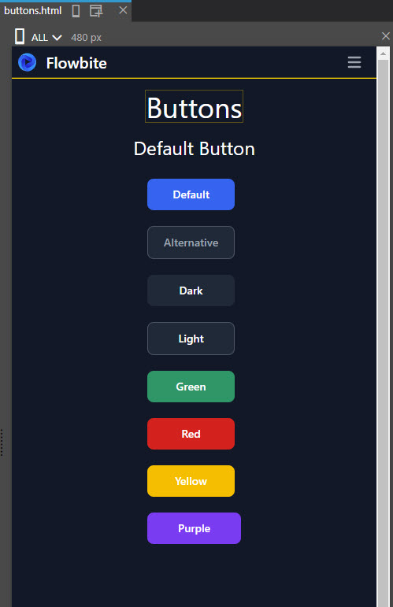
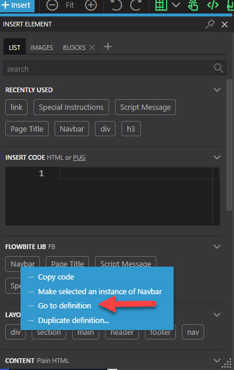

# Creating the Flowbite Custom Library

- [Creating the Flowbite Custom Library](#creating-the-flowbite-custom-library)
  - [Getting Started](#getting-started)
    - [Planning](#planning)
    - [Starting the project](#starting-the-project)
  - [Fleshing out the Custom Library Project](#fleshing-out-the-custom-library-project)
    - [Navigation](#navigation)
    - [Individual Flowbite component pages](#individual-flowbite-component-pages)
    - [Preparing to add the Flowbite components](#preparing-to-add-the-flowbite-components)
    - [Setting the Master Page](#setting-the-master-page)
  - [Putting the library together](#putting-the-library-together)
    - [Home page](#home-page)
    - [Buttons](#buttons)
    - [Tooltips](#tooltips)
    - [Altering the navbar so that it actually works](#altering-the-navbar-so-that-it-actually-works)
  - [Conclusion](#conclusion)

This tutorial aims to walk you through the process used to create the custom library of Flowbite components. As well as creating the library itself it will also cover some of the things that are available within Pinegrow to make this process more efficient, very specifically Components and Master Pages.

If you've read the more general tutorial on reusable libraries then you'll already know that it pays to plan your custom library in advance so that you can make best use of your workflow and the tools that Pinegrow puts at your disposal.

## Getting Started

### Planning

If you look at the [Flowbite](https://flowbite.com/) site and specifically at the [Docs section](https://flowbite.com/docs/getting-started/introduction/) you'll find a lot of information on their components. Obviously it's a pretty comprehensive collection, way too much for a single page, so we can establish from the outset that we'll be creating a multi-page library for these. It's also fair to say that it would probably make sense to split those pages into groups that will represent the Components themselves, Forms, and Typography. Flowbite also produce ready made blocks. The vast majority of these are actually paid-for items but each category or ready made blocks has at least one freely available item so it would probably make sense to include those as well.

We now know that we're going to have a multi-page custom library and that implies that it will need some sort of comprehensive means of navigating between the pages. We're probably not going to be able to build up the navigation to a fully functional completed item from the outset so it would make sense to make that a [Pinegrow component](https://pinegrow.com/docs/pinegrow-pro/components/). That way we will be able to build it up as we go along.

Closer examination of the Flowbite components reveals that some of them need to be able to reference Flowbite's own javascript in order to provide some additional functionality. For those components where this is the case we need to be able to indicate that. Again this suggests a reusable Pinegrow component might be useful.

Many of the Flowbite components are self explanatory in their purpose and use but others will probably warrant some additional explanation. Once again this is starting to suggest a reusable and editable Pinegrow component.

By now it's starting to look as if we will be needing a fairly structured, but adaptable template for each of the pages in the library that we want to create that will represent the Flowbite components. A Pinegrow Master page is starting to feel right for this.

### Starting the project

Now that we have a fairly good idea of what we are going to be doing let's kick off and build up a basic Pinegrow project that will act as our custom Flowbite component library.

If you've worked your way through some of the other tutorials here setting up a basic Tailwind based project (it will need to be Tailwind as that is what flowbite is based upon) should be pretty straight forward to you by now.

We'll kick off in VSCode in a new folder and then basically work your way through the instructions below. These are a combination of terminal commands and file edits.

1. `npm init -y`
2. `npm install -D tailwindcss postcss autoprefixer prettier prettier-plugin-tailwindcss @tailwindcss/typography flowbite`
3. `npx tailwindcss init -p`
4. Change the tailwind.config.js file to look like this.

```js
module.exports = {
  darkMode: "media",
  content: [
    "./_pginfo/**/*.{html,js,css}",
    "./*.{html,js,css}",
    "./inc/**/*.{html,js,css}",
  ],
  theme: {
    extend: {
      // <-- colors: pg_colors, //<-- Use the pg_colors for colors
      //<-- fontFamily: pg_fonts, //<-- Use the pg_fonts for fonts
    },
  },
  plugins: [require("flowbite/plugin"), require("@tailwindcss/typography")],
};
```

5. Create tailwind_theme folder.
6. Add source.css file to that folder
7. Add following to source.css

```
@tailwind base;
@tailwind components;
@tailwind utilities;
```

8. Add following to scripts section of package.json

```json
"scripts": {
    "dev": "npx tailwindcss -i ./tailwind_theme/source.css  -o ./tailwind_theme/tailwind.css  --watch",
    "build": "npx tailwindcss -i ./tailwind_theme/source.css  -o ./tailwind_theme/tailwind.css  --minify",
    "test": "echo \"Error: no test specified\" && exit 1"
  },
```

9. Add index.html file
10. type ! + Enter in it to flesh out a basic html document.
11. Add `<link href="tailwind_theme/tailwind.css" rel="stylesheet" type="text/css" />` to head section of the html.
12. `npm run dev`
13. Now open index.html in pg save as project, activate tailwind and setup external builder.
14. Uncomment the theme extensions in the tailwind.config.js file.

## Fleshing out the Custom Library Project

Now that we have created the basic projcet we'll turn our attention to doing most of the actual development work in Pinegrow itself.

We had decided that we were going to need some reusable components and a Master page so before doing anything else in the project panel in Pinegrow right click on the index.html file and select the duplicate option. In the dialog that appears name your new file lib.html.

The index.html is destined to become our Master page and the lib.html file will be the repository for our reusable components.

NB: at this stage the reusable components that are being refereed to are those that will be used in the project itself NOT the Flowbite components that we want in our custom library.

Before starting to design the library you might find it easier to switch the Pinegrow design surface responsive width to ALL. The library panel is normally displayed as a narrow vertical column so it makes sense to design with that in mind from the outset.

### Navigation

We'd decided that it would make sense to have all of the Flowbite components and that it would probably make sense to keep the delineation that they themselves have (Components, Forms and Typography) and in addition we'd add those blocks That are available free of charge. To my way of thinking that suggests a navbar with at least four items on it and those would almost certainly need to have dropdowns.

There are navbars amongst the Flowbite collection so it this instance it might make sense to utilise one of those if there's one that would fit the bill. As it happens there is one (Navbar with dropdown) which can almost certainly be adapted to meet our needs.

Open the lib.html file in Pinegrow check that the responsive width is set to ALL and if using V.7 or above click the insert button on the main toolbar at the top of the page.


From the library panel that opens drag a header section onto the page.

Now make your way the the [Flowbite docs navbar section](https://flowbite.com/docs/components/navbar/) and copy the code for the navbar with dropdown.

Now open the code for the lib.html file and in the new header section that you added paste in the code that you have just copied.


Remove the data-empty-placeholder attribute from the header. Save the file and it should then look like this.


Activate the Test Clicks feature in Pinegrow.


If you click on the hamburger icon nothing happens. That's because the Flowbite navbar needs some javascript to work properly so let's get that sorted out before we go any further.

Add the following line just above the closing <\body> tag in the lib.html code.

```html
<script src="https://unpkg.com/flowbite@1.5.5/dist/flowbite.js"></script>
```

We're going to use a direct reference to Flowbite's own online repository just in case they update it.

Save and close the file. Reopen it and click on the hamburger icon. The navbar should now work.

As we'll be using the navbar on every page we create and as those pages will be based on our Master Page open up the index.html code and paste the script line you just put in the lib.html page in exactly the same place, remembering to save your work once you've done that. Now it's there we should no longer need to worry about referencing it in the future.

The navbar will be turned into a component, which will be placed inside the header. So on the index.html page add a header element from the library and save the page.

Back in the lib.html page open the structure panel, minimise the the nav element and select it.


Open the Actions panel and in there select Define Comp.


In the Define component section give the component what must be a unique id and a name for display purposes. We'll use fb.navbar and Navbar respectively. Leave the other values as they are.


Now select the Section option.


In the Define Section dialog provide a name for a custom section that will hold our components in the Library panel, we'll go with Flowbite library.

Save everything then Click on the Orange arrows next to the Components menu item to update the components we've just created.


Now if you open the Library panel you'll see our newly created section along with its component.


The astute amongst you will have spotted the small typo I made when creating my custom section.

### Individual Flowbite component pages

Having earlier decided how we were going to arrange the library we should now consider how we will layout those pages.

The first choice ought probably centre around how the pages themselves will be laid out. To a certain extent this will be dictated by personal preference and the need to make the library easy to use. I freely admit to being an awful designer so please don't regard the choices that I've made in this respect as being either good, or for that matter properly integrated in tailwind.

The one overriding choice that I personally made was to ensure that the library was Dark mode compatible. Other than that, working on the principle that library pages are tall and narrow, some sort of centralised flex layout seems to make sense.

Clearly each page will require a heading indicating which Flowbite components are on that page.

With both those points in mind I added a section and heading to the index.html file body.

```html
<body>
  <header data-empty-placeholder></header>
  <section
    data-empty-placeholder
    class=" gap-4 mx-auto flex h-screen w-full flex-col items-center bg-white px-10 dark:bg-gray-900"
  >
    <h1 class="mt-4 text-2xl text-gray-900 dark:text-gray-100">Heading</h1>
  </section>
  <script src="https://unpkg.com/flowbite@1.5.5/dist/flowbite.js"></script>
</body>
```

Some of the flowbite components require the use of Javascript. To that end having a prominent note towards the top of the library page to that effect would make sense.

Using the index.html page as a template for the moment create the message. My message looked like this;

```html
<section
  data-empty-placeholder
  class=" gap-4 mx-auto flex h-screen w-full flex-col items-center bg-white px-10 dark:bg-gray-900"
>
  <h1 class="mt-4 text-2xl text-gray-900 dark:text-gray-100">Heading</h1>
  <div>
    <p class="mt-4 text-lg text-gray-900 dark:text-gray-100">
      These Flowbite components will require the flowbite.js script to be
      present on the page where they are being used.
    </p>
    <p class="mt-4 text-lg text-gray-900 dark:text-gray-100">
      Add a reference to the script immediately above the end body tag.
    </p>
  </div>
</section>
```


Copy the whole section to the lib.html page. In the lib page structure panel collapse the div in the section you just copied , select it and turn it into a component in the same way that you did with the navbar before using the actions panel.

Once you've done that and saved everything delete the message from the index.html page.

### Preparing to add the Flowbite components

Unfortunately there is no pre-defined repository for the Flowbite components. You have to refer to the documentation and then download the code for the relevant one(s) that you want. Our aim is to arrange these in our custom library in such a way that they are easily accessible and can be readily dragged to either a page or the structure tree. This will require looking at several of them, examining the way that they have been built and then how we, in the most efficient fashion, make them draggable.

My own conclusion to this, which I stress was my own and is not necessarily the best, was to add a new class (flowbite) to each of them and in some cases wrapping them in an outer dive with just that class attached. This decision will need to be explained on the main front page of the library to allow users to make informed choices about what they do once they have dragged a flowbite component to the page.

Many of the components in the flowbite documentation are laid ouy horizontally. This isn't really doing to work on tall narrow library pages so we'll need to ensure that they are laid out vertically. This will require additional work beyond just copy and paste manoeuvrers.

Lastly many of the Flowbite components require, in addition to some javascript, the use of data attributes to cement their functionality. That will require some explanation. As that differs from component type to component type that immediately suggests an instructions section component for our library, similar to the script message.

Let's tackle that last bit first.

In the lib.html page add the following html below the message bit.

```html
<div id="fb.instructions">
  <h2 class="mb-4 text-2xl text-gray-900 dark:text-white">
    Special Instructions
  </h2>
  <p class="mb-4 text-lg text-gray-900 dark:text-gray-100">
    add instructions here
  </p>
</div>
```

Turn that into a component as you have done before only this time make it editable as well. Select the editable option;


In the definition for the editable area give it an id and leave the inner content option checked, as that's what we want to ne able to edit.


### Setting the Master Page

We're almost at the stage now where we can set our index.html as a Master Page in order to use that as the template for each of the pages that will comprise our custom library.

At the moment our index page looks like this.


We're going to be changing the Page title (which is in essence what the heading is) on every page. Logically that probably ought to be a separate Pinegrow component as well, especially if for some reason we decide not to have a page title immediately below the navigation.

Return to the lib.html page and create a page title component out of the 'h1' tag that makes up the heading. Save it to the same section you created for the other components and make its inner content editable.

as soon as you've done that return to the index.html page and adjust the code to resemble the following.

```html
<!DOCTYPE html>
<html lang="en">
  <head>
    <meta charset="UTF-8" />
    <meta http-equiv="X-UA-Compatible" content="IE=edge" />
    <meta name="viewport" content="width=device-width, initial-scale=1.0" />
    <link href="tailwind_theme/tailwind.css" rel="stylesheet" type="text/css" />
    <title>Document</title>
  </head>
  <body>
    <header data-empty-placeholder></header>
    <section
      data-empty-placeholder
      class="flex flex-col items-center w-full h-screen gap-4 px-10 mx-auto bg-white dark:bg-gray-900"
    ></section>
    <script src="https://unpkg.com/flowbite@1.5.5/dist/flowbite.js"></script>
  </body>
</html>
```

The index.html page should now look like this.


Now select the index.html page in the structure panel


Flip to the actions panel and set the page as a Master Page.


Make sure that you then set the header area where the nav bar should go and the Main body area as editable areas as well. If you don't do this you wont be able to add components to or edit the the pages that you base on this Master page.


Click the Orange Arrows next to the components on the top menu and then reload the project in the project panel. It should now look like this.


Note the blue squares next to the index.htm indicating that it's a Master page and the blue jigsaw icon next to the lib.html page indicating that it contains custom components.

## Putting the library together

We're not going to go through the process of adding every last Flowbite component to the custom library. However we will create a home page and a couple of pages of components, one of which will house components that need javascript and thus need some special instructions and one set that don't.

We'll also need to look at altering the navbar to suit our needs as we go along and in the process illustrate one of the key benefits of Pinegrow components.

### Home page

In the project panel click on the project name and in the context menu that appears select Add new page


By default you'll be offered the chance to base that on our Master index.html page. Choose that.


Name your new page home.html in the next dialog that appears.


Once you have your new home page open remember to set the responsive width to All.

Now open the Library pane and from your newly added section of components that you'll find at the top of your library pane drag the navbar component to the top of your home page. Then drag a page title to the main body section and a special instructions component to the main body below the title. Edit these to meet your requirements. I altered my home page to look like this.


### Buttons

Next up will be the flowbite buttons. These don't require Javascript to function and when al is said and done a button is a button is a button. In other words they won't really need much more than a title on the page.

Looking at the [documentation page for the buttons](https://flowbite.com/docs/components/buttons/) we can see that the buttons have been laid out horizontally. This is not really going to work in our library where a vertical orientation is going to be more appropriate.

The buttons themselves all appear to be in their own button tags so to make them individually draggable we#re just going to need to add a new flowbite class to each button.

We will however probably need to display these in some sort of flex column layout.

In the project panel in Pinegrow add a new folder to the project called pages. Within that folder add a new folder called components and in that folder add a new page (based on the Master page) and name it buttons.html.

Add your navbar component to the page and a title. Edit the title to read 'Buttons'.

Immediately below the title add a div with an h3.

```html
<div class="mb-2 flex flex-col items-center gap-3">
  <h3 class="text-2xl text-gray-900 dark:text-white">Default Button</h3>
</div>
```

Below that add another div.

```html
<div class="flex flex-col gap-3"></div>
```

Now copy the code for the Default button from the Flowbite site and paste that within that last div. Add a flowbite class to each button tag. Here is the code example for the first default button. Note the presence of our flowbite class.

```html
<button
  type="button"
  class="flowbite mr-2 mb-2 rounded-lg bg-blue-700 px-5 py-2.5 text-sm font-medium text-white hover:bg-blue-800 focus:outline-none focus:ring-4 focus:ring-blue-300 dark:bg-blue-600 dark:hover:bg-blue-700 dark:focus:ring-blue-800"
>
  Default
</button>
```

The page should now look like this.



Repeat the process for the rest of the various buttons that are provided by Flowbite.

Finally set the h-screen class in the main section to h-full to render the correct background colour across the whole page.

### Tooltips

The Flowbite tooltips require javascript to work so this will give us a blueprint for how we should layout those pages. Again we'll need to ensure that the layout is vertically oriented.

We'll need a mew page (based on the Master) in the components folder called tooltips.html. That is going to need one each of the components that we created on our lib.html page. Your basic page (prior to any alterations) should look like this.


Once you made the necessary alterations and added the tooltip components you may well have a page that looks similar to this.


### Altering the navbar so that it actually works

We're more or less done but currently we just have the default navbar at the top of our pages which doesn't actually work with our site. Let's correct that now.

Open the library pane and locate the navbar component in the custom section you created. Right click on it and in the context menu that appears select go to definition.



The lib.html page will be opened and the navbar will be selected.

As a temporary measure set the responsive width to LG so that you can see the whole menu.


We'll heep the Home item and ensure that it points to our home page. Then we'll remove the Services, Pricing and Contact items, replacing then with duplicates of the dropdown item to represent our components, forms, typography and blocks.

Before you make the changes consult the flowbite documentation for the navbars to understand what id's you'll need to create to make it all work.

When you've finished you should hopefully have something like this.


Almost there. We'll tweak the dropdown menu for the components to reflect the two pages we've added to date, remove the active tailwind class on the Home item as that doesn't need to be white in this case and comment out the forms , typography and blocks sections until we're ready to use them.

Save everything, return the responsive view back to All and test your nav bar. It should hopefully resemble this.


Finally from the main Components menu on the Pinegrow tool bar select
Update the whole project.


Now open your Home page and see that the navbar has been magically updated.


That in a nutshell is the magic of Pinegrow components at work.

## Conclusion

Hopefully this will have given you an idea about how to set up your own custom libraries and more importantly in many ways the power of Pinegrow components and Master pages.
