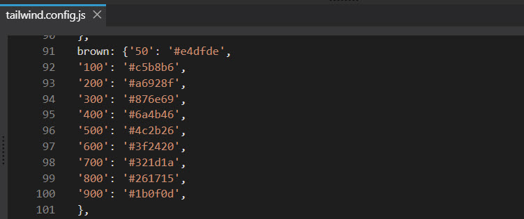

# Customising the Basic Theme

Now that we have a 'very' Basic Theme it's time to actually customise it so that it will match the needs and requirements of our client.

## Site Colours

Colour probably has the biggest impact on our senses and we all of us have a our favourite combination of colours. However the reality of site development is that we need to work within the constraints laid down by the client. Typically they will have some corporate colours which they want to see across the site.

Pinegrow's Design Pallet makes changing or adding colours very easy and out of the box it will support plain html / css, Bootstrap or Tailwind depending on which css variant you chose to use. All three support a predefined colour swatch and it may well be that that will be sufficient for your needs (especially with Tailwind as it creates such a wide variety of colours, shades and opacities out of the box) however it's equally likely that what's provided won't quite fit the requirement that you have so what can we do to change things.

If you open up the basic theme in Pinegrow and the open up the design panel you will see the following.


By default Pinegrow adds eight colours to the design panel and those eight colours are the ones that will be offered up as a choice when you are working with the properties panel for individual elements.


However you can still use the full panoply of [Tailwind default colours](https://tailwindcss.com/docs/customizing-colors) if you reference them directly in code.

If you are in the position to be able to liaise with your client from the outset and they have told you that they will be providing you with design files then it would pay you to tell them to have their designer make use of [this website](https://tailwind.simeongriggs.dev/blue/3B82F6). It's a site that allows one to generate colour pallets that follow Tailwind rules and will ensure that any colours they suggest will be accurately generated by Tailwind. All that they then need to do is supply you with the hex value for the 500 variant. Tailwind regards that value as being the one from which it will then generate lighter and darker shades.

> **_Note_** If you intend to support Dark Themes then make sure that suitable colour paletts exist for both light and dark modes.

Let's say that you are required to use a Brown colour and you've been given the hex value #4C2B26.

In the Design Panel in Pinegrow add a new colour by clicking the + button in the colours section.


In the Dialog that opens fill out the relevant sections and click add color.


Your new color will be added,


and will be available when setting element properties.


If you open up the tailwind.config.js file you'll see that Pinegrow has amended it with your new colour.



It's very common in website development to use names like primary. secondary etc to represent colour swatches. As you can see it's not difficult to implement something similar with Tailwind, and indeed any other CSS in Pinegrow.

The following article from the Pinegrow documentation should be read as it explains very well how you can go on to customise the other parts of a Tailwind theme to suit your requirements; [Tailind CSS Design Panels](https://pinegrow.com/docs/tailwind/tailwind-css-design-panel/).

## Accessibility

It is increasingly important that the websites that you create meet accessibility requirements. We didn't specifically cover that when creating the Basic Theme, now that is a matter that we should address.

We'll begin with a 'Skip Navigation' / 'Skip to Content' link. The idea with this is that anyone accessing your site via keyboard or screen reader can, if they so chose, skip over the navigation elements at the top of the page and move directly to the content.

A skip navigation link is essentially the first thing that will appear on a website page if the user is either navigating with the tab key or using a screen reader. If The enter key is then pressed the navigation links that would then normally have followed are skipped and focus is set to the main content.

Typically this will take the form of a relatively small button (technically it's not a button but by saying that you tend to know what it will look like) that appears at the top left of a site or something that covers the entire navbar as Microsoft does on their site. What it does is provide a link to jump directly to the main content.

Structurally the html of your page would look something like this.

```html
<head />
<body>
  <a href="#main">Skip to Content </a>
  <header>
    <nav />
  </header>
  <main id="main"></main>
  <footer />
</body>
```

Below you'll find potential implementations of both styles for the Basic Theme. Of the two the one that covers the entire navbar is by far the easiest to implement and it could be argued, from a semantic point, that it's actually the better implementation. It certainly true that it's much more difficult to implement something that resembles a small button and keep some semblance of design purity.

```html
<!--   <a
        class="absolute top-0 px-3 py-4 font-semibold text-white duration-300 ease-in-out -translate-y-16 bg-blue-800 rounded-b-lg dark:bg-gray-900 left-9 focus:translate-y-0"
        href="#main-content"
        >Skip To Content</a
      > -->

<a
  href="#main"
  class="dark:bg-gray-50 focus:pt-56 duration-300 ease-in-out -translate-y-16 absolute pt-20 container min-w-full flex flex-col justify-center text-white items-center top-0 left-0 focus: z-[999] focus:translate-y-0"
  >Skip to Content</a
>
```

      For this to work correctly we need to alter the the <section> tab we added beneath the <header> to <main>.

```html
<main id="main" wp-site-content>
  <div class="container min-w-full p-4 bg-white dark:bg-gray-800"></div>
</main>
```

And lastly we'll add some smooth scrolling via css to the page.

```html
<html
  lang="en"
  wp-template
  wp-template-export-as="index.php"
  wp-template-define-master-page="true"
  class="scroll-auto md:scroll-smooth"
></html>
```
