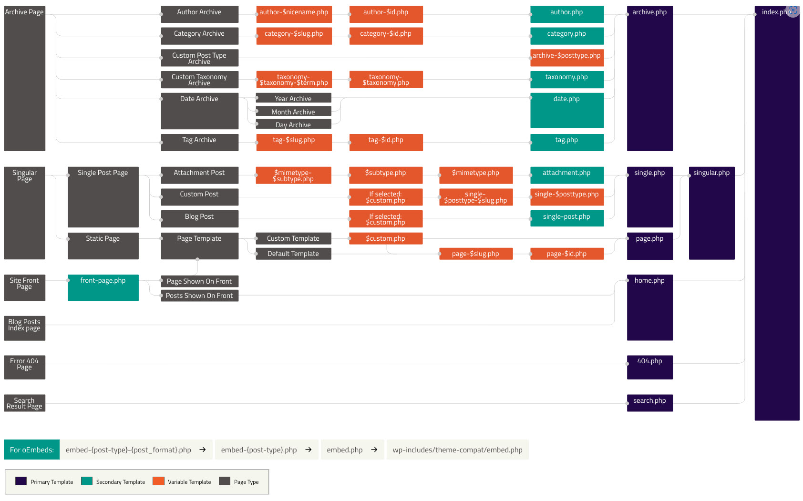
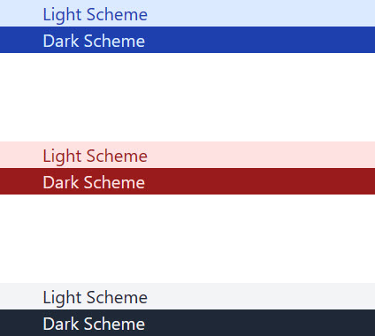
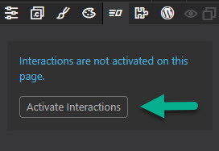
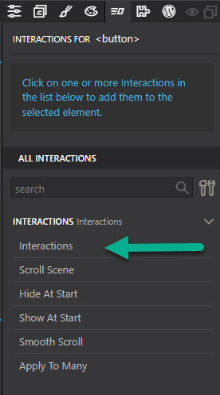
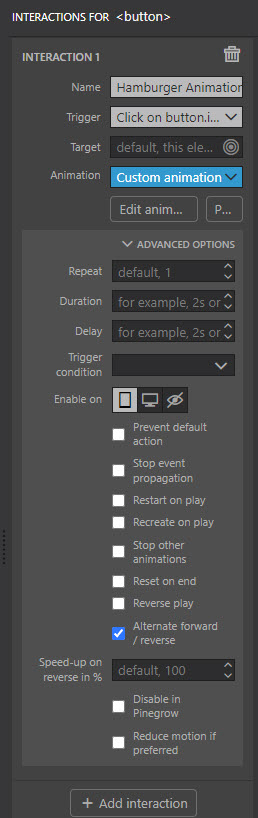
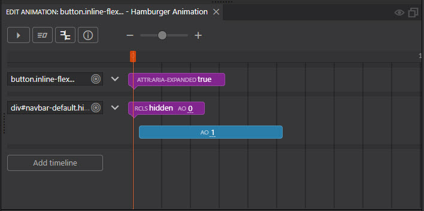
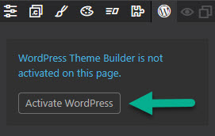

# Full Site Build (Part 2)

- [Full Site Build (Part 2)](#full-site-build-part-2)
  - [DarkMode support](#darkmode-support)
  - [Navigation Menu](#navigation-menu)
  - [Main Section and Footer](#main-section-and-footer)
  - [Activating Wordpress](#activating-wordpress)

Having sketched out our objectives in [part 1](fullsite.md) it's now time to start doing some work. It's going to be a WordPress site so at the back of our mind we need to keep in mind how the WordPress template system is structured.



We'll start off with the ultimate fall back template , our index.php on which we'll certainly need a header of some description, with some navigation, and very probably a footer. leaving a bit in the middle for content.

## DarkMode support

One major objective was the support of Dark Mode out of the box that means that we'll be wanting a predominantly light scree for those who prefer light mode and obviously a predominantly dark scree for those that prefer dark. Another objective was to make the site as accessible as possible. One aspect of accessibility os to have well defined contrast for items on the page and interestingly one of the oft overlooked aspects of Tailwind 's colour system is that it was designed with that very much to the fore. Tailwind colours are graded for 50 - 900. Gradients 50 - 600 should perfectly contrast with Gradients 600 - 900.

To see how this works consider the following very crude example;

```html
<body class="flex flex-col gap-20">
  <section>
    <div class="pl-10 bg-blue-100">
      <h1 class="text-blue-800">Light Scheme</h1>
    </div>
    <div class="pl-10 bg-blue-800">
      <h1 class="text-blue-100">Dark Scheme</h1>
    </div>
  </section>
  <section>
    <div class="pl-10 bg-red-100">
      <h1 class="text-red-800">Light Scheme</h1>
    </div>
    <div class="pl-10 bg-red-800">
      <h1 class="text-red-100">Dark Scheme</h1>
    </div>
  </section>
  <section>
    <div class="pl-10 bg-gray-100">
      <h1 class="text-gray-800">Light Scheme</h1>
    </div>
    <div class="pl-10 bg-gray-800">
      <h1 class="text-gray-100">Dark Scheme</h1>
    </div>
  </section>
</body>
```



Here we see Tailwind's default Blue, Red and Gray colours being used to produce simple examples of Light and Dark modes that actually work.

## Navigation Menu

With that in mind I set about creating a logo for the company that should across the colour grades finally settling on #9F9F9F as a colour that I though would work across everything that I was likely to use.

One of the often overlooked things that PowerPoint is actually rather good at doing is creating SVG images (obviously I'm talking image making for dummies here). After some playing around I came up with something that I felt I could live with, if for nothing else than the duration of this tutorial.


If you've read previous tutorials here you'll know I've been quite taken by some of the Flowbite bits and I'm going to use a navbar and footer for this site.

I chose to add the default navbar and substitute the flowbite logo for the one above, along with a couple of small changes to the background colour.

The biggest change though was substituting the Flowbite js that makes the hamburger button display the menu on mobile with Pinegrow interactions. As I have plans for interactions elsewhere it makes sense to use it here as well.

The Hamburger is within a button on the navbar so that is what well want to use to trigger the interactions we'll add.

Firstly add Interactions to your page by activating them via the Interactions tab.



Once you've done that select the navbar button and click on Interactions.



You will then need to configure the interaction like so;



then click on the Edit Animation buttion to edit the timeline which should end up looking like this.



The hamburger menu should now be interactive.

You'll find more information about Pinegrow Interactions in the [documentation](https://pinegrow.com/docs/interactions/).

## Main Section and Footer

Our template will also need some sort of middle section into which content that comes from posts and pages can be inserted and finally a footer.

For the sake od consistency we'll use the flowbite default footer and make some small changes to the code to add a dynamic copyright date.

Our completed index.html is going to look like this.

```html
<!DOCTYPE html>
<html lang="en">
  <head>
    <meta charset="UTF-8" />
    <meta http-equiv="X-UA-Compatible" content="IE=edge" />
    <meta name="viewport" content="width=device-width, initial-scale=1.0" />
    <link href="/tailwind_theme/tailwind.css" rel="stylesheet" />
    <title>Main</title>
    <script>
      /* Pinegrow Interactions, do not remove */ (function () {
        try {
          if (!document.documentElement.hasAttribute("data-pg-ia-disabled")) {
            window.pgia_small_mq =
              typeof pgia_small_mq == "string"
                ? pgia_small_mq
                : "(max-width:767px)";
            window.pgia_large_mq =
              typeof pgia_large_mq == "string"
                ? pgia_large_mq
                : "(min-width:768px)";
            var style = document.createElement("style");
            var pgcss =
              'html:not(.pg-ia-no-preview) [data-pg-ia-hide=""] {opacity:0;visibility:hidden;}html:not(.pg-ia-no-preview) [data-pg-ia-show=""] {opacity:1;visibility:visible;display:block;}';
            if (
              document.documentElement.hasAttribute("data-pg-id") &&
              document.documentElement.hasAttribute("data-pg-mobile")
            ) {
              pgia_small_mq = "(min-width:0)";
              pgia_large_mq = "(min-width:99999px)";
            }
            pgcss +=
              "@media " +
              pgia_small_mq +
              '{ html:not(.pg-ia-no-preview) [data-pg-ia-hide="mobile"] {opacity:0;visibility:hidden;}html:not(.pg-ia-no-preview) [data-pg-ia-show="mobile"] {opacity:1;visibility:visible;display:block;}}';
            pgcss +=
              "@media " +
              pgia_large_mq +
              '{html:not(.pg-ia-no-preview) [data-pg-ia-hide="desktop"] {opacity:0;visibility:hidden;}html:not(.pg-ia-no-preview) [data-pg-ia-show="desktop"] {opacity:1;visibility:visible;display:block;}}';
            style.innerHTML = pgcss;
            document.querySelector("head").appendChild(style);
          }
        } catch (e) {
          console && console.log(e);
        }
      })();
    </script>
  </head>
  <body>
    <header>
      <nav
        class="bg-gray-200 border-gray-200 px-2 sm:px-4 py-2.5 dark:bg-gray-900"
      >
        <div
          class="container flex flex-wrap items-center justify-between mx-auto"
        >
          <a href="./index.html" class="flex items-center">
            
            <span
              class="self-center text-xl font-semibold whitespace-nowrap dark:text-white"
            ></span>
          </a>
          <button
            data-collapse-toggle="navbar-default"
            type="button"
            class="inline-flex items-center p-2 ml-3 text-sm text-gray-500 rounded-lg md:hidden hover:bg-gray-100 focus:outline-none focus:ring-2 focus:ring-gray-200 dark:text-gray-400 dark:hover:bg-gray-700 dark:focus:ring-gray-600"
            aria-controls="navbar-default"
            aria-expanded="false"
            data-pg-ia='{"l":[{"name":"Hamburger Animation","trg":"click","a":{"l":[{"t":"","l":[{"t":"set","p":0,"d":0,"l":{"attr":{"aria-expanded":"true"}}}]},{"t":"$#navbar-default","l":[{"t":"set","p":0,"d":0,"l":{"class.remove":"hidden","autoAlpha":0}},{"t":"tween","p":0.02,"d":0.5,"l":{"autoAlpha":1}}]}]},"on":"mobile","trev":"true"}]}'
          >
            <span class="sr-only">Open main menu</span>
            <svg
              class="w-6 h-6"
              aria-hidden="true"
              fill="currentColor"
              viewBox="0 0 20 20"
              xmlns="http://www.w3.org/2000/svg"
            >
              <path
                fill-rule="evenodd"
                d="M3 5a1 1 0 011-1h12a1 1 0 110 2H4a1 1 0 01-1-1zM3 10a1 1 0 011-1h12a1 1 0 110 2H4a1 1 0 01-1-1zM3 15a1 1 0 011-1h12a1 1 0 110 2H4a1 1 0 01-1-1z"
                clip-rule="evenodd"
              ></path>
            </svg>
          </button>
          <div class="hidden w-full md:block md:w-auto" id="navbar-default">
            <ul
              class="flex flex-col p-4 mt-4 border border-gray-100 rounded-lg bg-gray-50 md:flex-row md:space-x-8 md:mt-0 md:text-sm md:font-medium md:border-0 md:bg-white dark:bg-gray-800 md:dark:bg-gray-900 dark:border-gray-700"
            >
              <li>
                <a
                  href="#"
                  class="block py-2 pl-3 pr-4 text-white bg-blue-700 rounded md:bg-transparent md:text-blue-700 md:p-0 dark:text-white"
                  aria-current="page"
                  >Home</a
                >
              </li>
              <li>
                <a
                  href="#"
                  class="block py-2 pl-3 pr-4 text-gray-700 rounded hover:bg-gray-100 md:hover:bg-transparent md:border-0 md:hover:text-blue-700 md:p-0 dark:text-gray-400 md:dark:hover:text-white dark:hover:bg-gray-700 dark:hover:text-white md:dark:hover:bg-transparent"
                  >About</a
                >
              </li>
              <li>
                <a
                  href="#"
                  class="block py-2 pl-3 pr-4 text-gray-700 rounded hover:bg-gray-100 md:hover:bg-transparent md:border-0 md:hover:text-blue-700 md:p-0 dark:text-gray-400 md:dark:hover:text-white dark:hover:bg-gray-700 dark:hover:text-white md:dark:hover:bg-transparent"
                  >Services</a
                >
              </li>
              <li>
                <a
                  href="#"
                  class="block py-2 pl-3 pr-4 text-gray-700 rounded hover:bg-gray-100 md:hover:bg-transparent md:border-0 md:hover:text-blue-700 md:p-0 dark:text-gray-400 md:dark:hover:text-white dark:hover:bg-gray-700 dark:hover:text-white md:dark:hover:bg-transparent"
                  >Pricing</a
                >
              </li>
              <li>
                <a
                  href="#"
                  class="block py-2 pl-3 pr-4 text-gray-700 rounded hover:bg-gray-100 md:hover:bg-transparent md:border-0 md:hover:text-blue-700 md:p-0 dark:text-gray-400 md:dark:hover:text-white dark:hover:bg-gray-700 dark:hover:text-white md:dark:hover:bg-transparent"
                  >Contact</a
                >
              </li>
            </ul>
          </div>
        </div>
      </nav>
    </header>
    <main data-empty-placeholder class="bg-gray-200 dark:bg-gray-900"></main>
    <footer
      class="p-4 bg-gray-200 shadow  md:flex md:items-center md:justify-between md:p-6 dark:bg-gray-900"
    >
      <div class="text-sm text-gray-500 dark:text-gray-200 sm:text-center">
        &copy; 2020 -<span id="copyright">
          <script>
            document
              .getElementById("copyright")
              .appendChild(document.createTextNode(new Date().getFullYear()));
          </script>
        </span>
        Vtl Software Ltd. All Rights Reserved.
      </div>
      <!-- <ul
     class="flex flex-wrap items-center mt-3 text-sm text-gray-500 dark:text-gray-400 sm:mt-0"
   >
     <li>
       <a href="#" class="mr-4 hover:underline md:mr-6">About</a>
     </li>
     <li>
       <a href="#" class="mr-4 hover:underline md:mr-6">Privacy Policy</a>
     </li>
     <li>
       <a href="#" class="mr-4 hover:underline md:mr-6">Licensing</a>
     </li>
     <li>
       <a href="#" class="hover:underline">Contact</a>
     </li>
   </ul>-->
    </footer>
    <script src="pgia/lib/pgia.js"></script>
  </body>
</html>
```

## Activating Wordpress

Before we actively connect our new project with a WordPress site let's do one small bit of work on the local site just to make things a bit easier for us.

In the local site create a new main menu. You might need to create a couple of blank pages first to add to the menu but that really is all they need to be although adding a little bit of content will be of use later, we're just after some structure for the menu.

**NB: you may well find this task easier if you select the twenty twenty one theme or below as the new full site editor in WordPress still leaves something to be desired, especially in the menu creation department.**

With that done it's time to activate WordPress.

1 If you haven't already activate Wordpress in the project.



2 Fill out the WordPress Theme Settings Dialog (you only really need to fill out the Theme information section at this stage, making sure that the Project Type remains at its default setting of Theme).

3 Add the Site Content wordpress action to the central 'Main' section of your index.html

4 Add the Menu WordPress action to the UL list part or the navbar and set it to be the primary menu.

5 Save everything and then export it.

6 Open the local site and set your new theme to be the default and then open up one of your pages.

7 Oops nothing there other than the menu and footer.

8 You'll notice that a few things don't look quite right, we'll need to make some adjustments to our index.html

```html
<!DOCTYPE html>
<html
  lang="en"
  wp-template
  wp-template-export-as="index.php"
  wp-template-define-master-page="true"
>
  <head>
    <meta charset="UTF-8" />
    <meta http-equiv="X-UA-Compatible" content="IE=edge" />
    <meta name="viewport" content="width=device-width, initial-scale=1.0" />
    <link href="/tailwind_theme/tailwind.css" rel="stylesheet" />
    <title>Main</title>
    <script>
      /* Pinegrow Interactions, do not remove */ (function () {
        try {
          if (!document.documentElement.hasAttribute("data-pg-ia-disabled")) {
            window.pgia_small_mq =
              typeof pgia_small_mq == "string"
                ? pgia_small_mq
                : "(max-width:767px)";
            window.pgia_large_mq =
              typeof pgia_large_mq == "string"
                ? pgia_large_mq
                : "(min-width:768px)";
            var style = document.createElement("style");
            var pgcss =
              'html:not(.pg-ia-no-preview) [data-pg-ia-hide=""] {opacity:0;visibility:hidden;}html:not(.pg-ia-no-preview) [data-pg-ia-show=""] {opacity:1;visibility:visible;display:block;}';
            if (
              document.documentElement.hasAttribute("data-pg-id") &&
              document.documentElement.hasAttribute("data-pg-mobile")
            ) {
              pgia_small_mq = "(min-width:0)";
              pgia_large_mq = "(min-width:99999px)";
            }
            pgcss +=
              "@media " +
              pgia_small_mq +
              '{ html:not(.pg-ia-no-preview) [data-pg-ia-hide="mobile"] {opacity:0;visibility:hidden;}html:not(.pg-ia-no-preview) [data-pg-ia-show="mobile"] {opacity:1;visibility:visible;display:block;}}';
            pgcss +=
              "@media " +
              pgia_large_mq +
              '{html:not(.pg-ia-no-preview) [data-pg-ia-hide="desktop"] {opacity:0;visibility:hidden;}html:not(.pg-ia-no-preview) [data-pg-ia-show="desktop"] {opacity:1;visibility:visible;display:block;}}';
            style.innerHTML = pgcss;
            document.querySelector("head").appendChild(style);
          }
        } catch (e) {
          console && console.log(e);
        }
      })();
    </script>
  </head>
  <body>
    <header>
      <nav
        class="bg-gray-200 border-gray-200 px-2 sm:px-4 py-2.5 dark:bg-gray-900"
      >
        <div
          class="container flex flex-wrap items-center justify-between mx-auto"
        >
          <a href="./index.html" class="flex items-center">
            
            <span
              class="self-center text-xl font-semibold whitespace-nowrap dark:text-white"
            ></span>
          </a>
          <button
            data-collapse-toggle="navbar-default"
            type="button"
            class="inline-flex items-center p-2 ml-3 text-sm text-gray-500 rounded-lg md:hidden hover:bg-gray-100 focus:outline-none focus:ring-2 focus:ring-gray-200 dark:text-gray-400 dark:hover:bg-gray-700 dark:focus:ring-gray-600"
            aria-controls="navbar-default"
            aria-expanded="false"
            data-pg-ia='{"l":[{"name":"Hamburger Animation","trg":"click","a":{"l":[{"t":"","l":[{"t":"set","p":0,"d":0,"l":{"attr":{"aria-expanded":"true"}}}]},{"t":"$#navbar-default","l":[{"t":"set","p":0,"d":0,"l":{"class.remove":"hidden","autoAlpha":0}},{"t":"tween","p":0.02,"d":0.5,"l":{"autoAlpha":1}}]}]},"on":"mobile","trev":"true"}]}'
          >
            <span class="sr-only">Open main menu</span>
            <svg
              class="w-6 h-6"
              aria-hidden="true"
              fill="currentColor"
              viewBox="0 0 20 20"
              xmlns="http://www.w3.org/2000/svg"
            >
              <path
                fill-rule="evenodd"
                d="M3 5a1 1 0 011-1h12a1 1 0 110 2H4a1 1 0 01-1-1zM3 10a1 1 0 011-1h12a1 1 0 110 2H4a1 1 0 01-1-1zM3 15a1 1 0 011-1h12a1 1 0 110 2H4a1 1 0 01-1-1z"
                clip-rule="evenodd"
              ></path>
            </svg>
          </button>
          <div class="hidden w-full md:block md:w-auto" id="navbar-default">
            <ul
              class="flex flex-col p-4 mt-4 border border-gray-100 rounded-lg bg-gray-50 md:flex-row md:space-x-8 md:mt-0 md:text-sm md:font-medium md:border-0 md:bg-white dark:bg-gray-800 md:dark:bg-gray-900 dark:border-gray-700"
              cms-menu="primary"
            >
              <li>
                <a
                  href="#"
                  class="block py-2 pl-3 pr-4 text-gray-700 rounded hover:bg-gray-100 md:hover:bg-transparent md:border-0 md:hover:text-blue-700 md:p-0 dark:text-gray-400 md:dark:hover:text-white dark:hover:bg-gray-700 dark:hover:text-white md:dark:hover:bg-transparent"
                  aria-current="page"
                  >Home</a
                >
              </li>
              <li>
                <a
                  href="#"
                  class="block py-2 pl-3 pr-4 text-gray-700 rounded hover:bg-gray-100 md:hover:bg-transparent md:border-0 md:hover:text-blue-700 md:p-0 dark:text-gray-400 md:dark:hover:text-white dark:hover:bg-gray-700 dark:hover:text-white md:dark:hover:bg-transparent"
                  >About</a
                >
              </li>
              <li>
                <a
                  href="#"
                  class="block py-2 pl-3 pr-4 text-gray-700 rounded hover:bg-gray-100 md:hover:bg-transparent md:border-0 md:hover:text-blue-700 md:p-0 dark:text-gray-400 md:dark:hover:text-white dark:hover:bg-gray-700 dark:hover:text-white md:dark:hover:bg-transparent"
                  >Services</a
                >
              </li>
              <li>
                <a
                  href="#"
                  class="block py-2 pl-3 pr-4 text-gray-700 rounded hover:bg-gray-100 md:hover:bg-transparent md:border-0 md:hover:text-blue-700 md:p-0 dark:text-gray-400 md:dark:hover:text-white dark:hover:bg-gray-700 dark:hover:text-white md:dark:hover:bg-transparent"
                  >Pricing</a
                >
              </li>
              <li>
                <a
                  href="#"
                  class="block py-2 pl-3 pr-4 text-gray-700 rounded hover:bg-gray-100 md:hover:bg-transparent md:border-0 md:hover:text-blue-700 md:p-0 dark:text-gray-400 md:dark:hover:text-white dark:hover:bg-gray-700 dark:hover:text-white md:dark:hover:bg-transparent"
                  >Contact</a
                >
              </li>
            </ul>
          </div>
        </div>
      </nav>
    </header>
    <section
      data-empty-placeholder
      class="text-gray-800 bg-gray-200 dark:bg-gray-900 dark:text-gray-200"
      wp-site-content
    ></section>
    <footer
      class="flex flex-wrap p-4 mx-auto bg-gray-200 shadow md:flex md:items-center md:justify-between dark:bg-gray-900"
    >
      <div
        class="container flex flex-wrap mx-auto text-sm text-gray-500 justify-items-start dark:text-gray-200 sm:text-center"
      >
        &copy; 2020 -<span id="copyright">
          <script>
            document
              .getElementById("copyright")
              .appendChild(document.createTextNode(new Date().getFullYear()));
          </script>
        </span>
        &nbsp; Vtl Software Ltd. All Rights Reserved.
      </div>
      <!-- <ul
        class="flex flex-wrap items-center mt-3 text-sm text-gray-500 dark:text-gray-400 sm:mt-0"
      >
        <li>
          <a href="#" class="mr-4 hover:underline md:mr-6">About</a>
        </li>
        <li>
          <a href="#" class="mr-4 hover:underline md:mr-6">Privacy Policy</a>
        </li>
        <li>
          <a href="#" class="mr-4 hover:underline md:mr-6">Licensing</a>
        </li>
        <li>
          <a href="#" class="hover:underline">Contact</a>
        </li>
      </ul>-->
    </footer>
    <script src="pgia/lib/pgia.js"></script>
  </body>
</html>
```

8 Back in Pinegrow add a new file to your project called page.html.

9 Add the following html to it.

```html
<!DOCTYPE html>
<html lang="en" wp-template>
  <head>
    <meta charset="UTF-8" />
    <meta http-equiv="X-UA-Compatible" content="IE=edge" />
    <meta name="viewport" content="width=device-width, initial-scale=1.0" />
    <link href="/tailwind_theme/tailwind.css" rel="stylesheet" />
    <title>page/post template</title>
  </head>
  <body>
    <section wp-site-content>
      <div class="container p-4 mx-auto prose prose-lg" cms-post-content></div>
    </section>
  </body>
</html>
```

10 Save everything, export the theme and look at your pages again.

11 That's a bit better.
