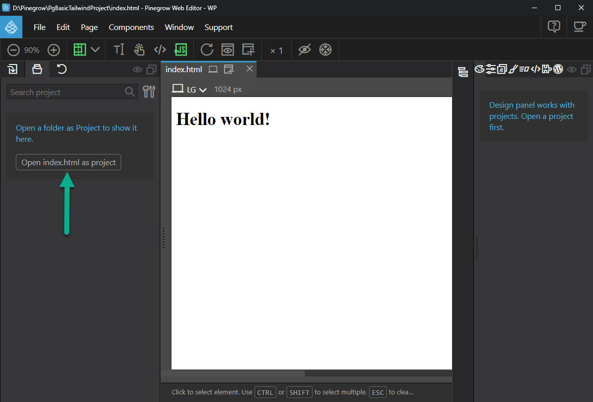

# How to setup a Pinegrow Project from the basic tailwind site

We are now going to use the BaseTheme that we created before to create a basic Pinegrow Tailwind project.

Navigate to the [GitHub repository](https://github.com/domsinclair/BaseTheme) for the base theme, click on the code button and select Download Zip.  We just want the code from the repository as we won't be cloning it.


Create a new folder on your computer and extract the contents of the zip file to it.  You want to end up with something that looks like this.


Note that the readme.md file has been deleted as it serves no useful purpose here.

Now open Pinegrow and select 'Open File'. in the open file dialog that opens navigate to your newly created folder and in there select the index.html file.

The file will be opened.  Pinegrow will recognise that it is using Tailwind automatically.  As soon as the file has opened Pinegrow will prompt you to open index.html as a project.  Do so.





As soon as the file has been opened as a project Pinegrow suggests that we Activate the design panel so that we can customise the design theme for our project.  Do so.


As soon as you click Activate Pinegrow will ask if you want to use the built in compiler or the external compiler.


---
**NOTE**

Pinegrow's built in compiler is tied to specific versions of the Tailwind CSS.  At the time of writing tis tutorial the most recently supported version of Tailwind for use in the built in compiler was version 3.0.  

The BaseTheme was originally built on version 3.2.1 and as that supports features that may be useful we'll opt for the external compiler.

___


Pinegrow now informs us that the Tailwind CSS source file isn't set.  Open the Tailwind CSS options.


In the dialog that opens 'External build process' will have been chosen by defualt in the compiler field.  In the Source CSS file field navigate to the tailwind_theme folder and select the source.css file therein.

Click Save.

At this point Pinegrow will make some changes so that you can successfully customise the Tailwind CSS (typically you may wish to add additional colours and fonts).

Had the folder not already existed the tailwind_theme folder would have been added and a warning dialog displayed.  That folder is required by the built in compiler and as it's possible to swith between built in and external build processes it makes sense to have that folder which is why it was added when the BaseTheme project was made.

The source.css file gains some additions;

```css
/* Pinegrow generated Design Panel Init Begin */

    /* Pinegrow generated Design Panel Init End */
@tailwind base;
@tailwind components;
@tailwind utilities;
/* Pinegrow generated Design Panel Extra Rules Begin */
body, html {
    min-height: 100vh;
}

    /* Pinegrow generated Design Panel Extra Rules End */
    ```
```


As does the tailwind.config.js file;    

```js

/* Pinegrow generated Design Panel Begin */

const pg_colors = {gray: {'50': '#f9fafb',
'100': '#f3f4f6',
'200': '#e5e7eb',
'300': '#d1d5db',
'400': '#9ca3af',
'500': '#6b7280',
'600': '#4b5563',
'700': '#374151',
'800': '#1f2937',
'900': '#111827',
},
red: {'50': '#fef2f2',
'100': '#fee2e2',
'200': '#fecaca',
'300': '#fca5a5',
'400': '#f87171',
'500': '#ef4444',
'600': '#dc2626',
'700': '#b91c1c',
'800': '#991b1b',
'900': '#7f1d1d',
},
yellow: {'50': '#fffbeb',
'100': '#fef3c7',
'200': '#fde68a',
'300': '#fcd34d',
'400': '#fbbf24',
'500': '#f59e0b',
'600': '#d97706',
'700': '#b45309',
'800': '#92400e',
'900': '#78350f',
},
green: {'50': '#ecfdf5',
'100': '#d1fae5',
'200': '#a7f3d0',
'300': '#6ee7b7',
'400': '#34d399',
'500': '#10b981',
'600': '#059669',
'700': '#047857',
'800': '#065f46',
'900': '#064e3b',
},
blue: {'50': '#eff6ff',
'100': '#dbeafe',
'200': '#bfdbfe',
'300': '#93c5fd',
'400': '#60a5fa',
'500': '#3b82f6',
'600': '#2563eb',
'700': '#1d4ed8',
'800': '#1e40af',
'900': '#1e3a8a',
},
indigo: {'50': '#eef2ff',
'100': '#e0e7ff',
'200': '#c7d2fe',
'300': '#a5b4fc',
'400': '#818cf8',
'500': '#6366f1',
'600': '#4f46e5',
'700': '#4338ca',
'800': '#3730a3',
'900': '#312e81',
},
purple: {'50': '#f5f3ff',
'100': '#ede9fe',
'200': '#ddd6fe',
'300': '#c4b5fd',
'400': '#a78bfa',
'500': '#8b5cf6',
'600': '#7c3aed',
'700': '#6d28d9',
'800': '#5b21b6',
'900': '#4c1d95',
},
pink: {'50': '#fdf2f8',
'100': '#fce7f3',
'200': '#fbcfe8',
'300': '#f9a8d4',
'400': '#f472b6',
'500': '#ec4899',
'600': '#db2777',
'700': '#be185d',
'800': '#9d174d',
'900': '#831843',
},
}

const pg_fonts = {}                
                
    /* Pinegrow generated Design Panel End */
/** @type {import('tailwindcss').Config} */
module.exports = {
  content: ["./*.{html,js}"],
  theme: {
    extend: {},
  },
  plugins: [],
}
```

Pinegrow has declared two constants pg_colors and pg_fonts.  More on these in a bit.

Lastly Pinegrow has created another file called used-classes.html in the -pginfo folder.

We now need to make some small but important changes.

---
**NOTE**

You'll probably find this easier to do in VSCode, so open up the project folder in VSCode.  However before you start add a couple of extensions to it that will make things easier.  

The first is Pinegrow Live Sync that syns vs code and pinegrow.


the second is Tailwind CSS Intellisense


___


In the tailwind.config.js file navigate to the bottom and amend the content and theme sections.

```js
/** @type {import('tailwindcss').Config} */
module.exports = {
  content: ["./_pginfo/**/*.{html,js,css}",
  "./*.{html,js,css}",
  "./inc/**/*.{html,js,css}",
],
  theme: {
    extend: {
      colors: pg_colors, //<-- Use the pg_colors for colors
      fontFamily: pg_fonts, //<-- Use the pg_fonts for fonts
    },
  },
  plugins: [],
}
```

Add an additional line to the scripts section of the package.json file.

```json
{
  "name": "BaseTheme",
  "version": "1.0.0",
  "description": "",
  "main": "index.js",
  "scripts": {
    "dev": "npx tailwindcss -i ./tailwind_theme/source.css  -o ./tailwind_theme/tailwind.css  --watch"
    "pgserver": "browser-sync start --proxy 'http://127.0.0.1:40000'"
  },
  "keywords": [],
  "author": "",
  "license": "ISC",
  "devDependencies": {
    "autoprefixer": "^10.4.12",
    "postcss": "^8.4.18",
    "tailwindcss": "^3.2.1"
  }
}

```

Save all of your changes.

The line that you just added automatically starts up pinegrow's built in browser sync, however for this to work you must ensure that BrowserSync is actively installed.

in VSCode open a terminal and at the command prompt type the following

```npm install -g browser-sync```

Now close the project in Pinegrow and then reopen it.

As soon as the project reopens open the index.html file and then press 

<kbd>Ctrl</kbd> + <kbd>B</kbd>

The index.html page will open in your browser
