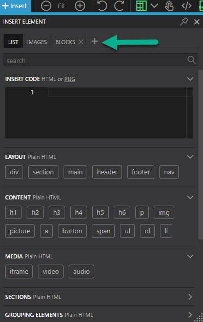
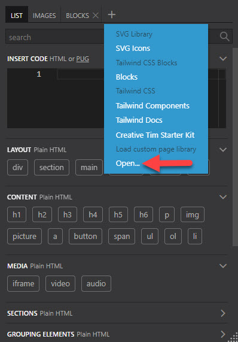
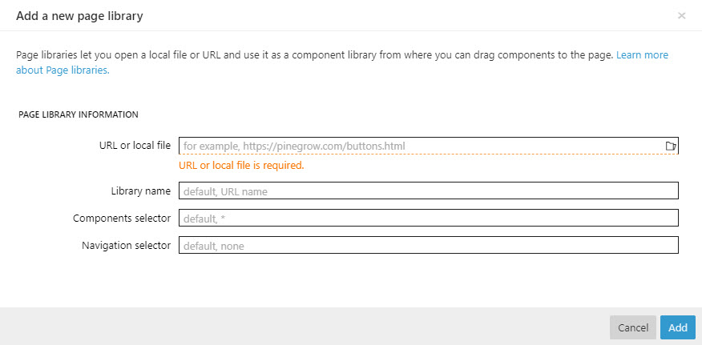
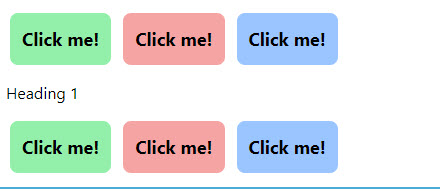

# Reusable Libraries

- [Reusable Libraries](#reusable-libraries)
  - [Getting started](#getting-started)
    - [URL or Local File](#url-or-local-file)
    - [Library Name](#library-name)
    - [Components Selector](#components-selector)
    - [Navigation Selector](#navigation-selector)
  - [Creating a Library](#creating-a-library)
  - [Putting this all into Practice](#putting-this-all-into-practice)
  - [Conclusion](#conclusion)

One of the rather nice things about Pinegrow is the fact that you can create reusable libraries of components and blocks for use in multiple projects. A design and create once but use often philosophy. Not only can this be an immense time saver but it promotes the idea of designing something properly once and then being able to reuse whenever you require something like it rather than having to continually reinvent the wheel.

This tutorial will hopefully show you how easy it is to actually create your own custom libraries.

## Getting started

We'll begin by looking at how you would add a custom library to a project that you're currently working on. In the library panel click on the + symbol to create a new Library tab/page.



On the Context Menu that appears select Open.



This will open up a dialog allowing to to set the parameters for your custom library page.



The choices that you are normally asked to set here will in fact go a long way to determining how you want to create your custom library page and with that at the back of our mind let's consider what those choices are and what the implication of them are.

### URL or Local File

This is in essence the 'address of the custom library page(s). If it's going to be something for purely personal use then it could well be a local resource on your own hard drive but if it'ss a collection of things that you want to make available to your team or potentially sell to the wider public then this really needs to be a publicly accessible source.

### Library Name

This is the name that the Library will be known by and displayed in the Tab title.

### Components Selector

This is perhaps the most important thing to set because it determines what item can be dragged from the Library to the page or the structure tree.

Consider this collection of elements.



The html that makes this up is shown below

```html
<!DOCTYPE html>
<html lang="en">
  <head>
    <meta charset="utf-8" />
    <meta
      name="viewport"
      content="width=device-width, initial-scale=1, shrink-to-fit=no"
    />
    <title>New page</title>
    <script src="https://cdn.tailwindcss.com/"></script>
  </head>
  <body>
    <section>
      <div
        class="gap-3 p-4 flex flex-wrap items-center mx-auto"
        data-pg-collapsed
      >
        <button class="text-lg font-bold rounded-lg bg-green-300 p-3">
          Click me!
        </button>
        <button class="text-lg font-bold rounded-lg bg-red-300 p-3">
          Click me!
        </button>
        <button class="text-lg font-bold rounded-lg bg-blue-300 p-3">
          Click me!
        </button>
      </div>
      <div>
        <h1 class="pl-3">Heading 1</h1>
      </div>
      <div
        class="gap-3 p-4 flex flex-wrap items-center mx-auto"
        data-pg-collapsed
      >
        <button class="text-lg font-bold rounded-lg bg-green-300 p-3">
          Click me!
        </button>
        <button class="text-lg font-bold rounded-lg bg-red-300 p-3">
          Click me!
        </button>
        <button class="text-lg font-bold rounded-lg bg-blue-300 p-3">
          Click me!
        </button>
      </div>
    </section>
  </body>
</html>
```

If we were to add section into this field then everything that is illustrated would be selectable as a single object in the Library page.

If we were to put div in that field then we would be able to select the topmost group of buttons, the heading and the bottom group of buttons.

Putting button in that field would allow us to select all six buttons individually but we'd be unable to select the top or bottom group of buttons as a whole.

we could however add a custom class to the field .vtl and amend the html like so.

```html
<!DOCTYPE html>
<html lang="en">
  <head>
    <meta charset="utf-8" />
    <meta
      name="viewport"
      content="width=device-width, initial-scale=1, shrink-to-fit=no"
    />
    <title>New page</title>
    <script src="https://cdn.tailwindcss.com/"></script>
  </head>
  <body>
    <section>
      <div
        class="vtl gap-3 p-4 flex flex-wrap items-center mx-auto"
        data-pg-collapsed
      >
        <button class="text-lg font-bold rounded-lg bg-green-300 p-3">
          Click me!
        </button>
        <button class="text-lg font-bold rounded-lg bg-red-300 p-3">
          Click me!
        </button>
        <button class="text-lg font-bold rounded-lg bg-blue-300 p-3">
          Click me!
        </button>
      </div>
      <div>
        <h1 class="pl-3">Heading 1</h1>
      </div>
      <div
        class="gap-3 p-4 flex flex-wrap items-center mx-auto"
        data-pg-collapsed
      >
        <button class="vtl text-lg font-bold rounded-lg bg-green-300 p-3">
          Click me!
        </button>
        <button class="vtl text-lg font-bold rounded-lg bg-red-300 p-3">
          Click me!
        </button>
        <button class="vtl text-lg font-bold rounded-lg bg-blue-300 p-3">
          Click me!
        </button>
      </div>
    </section>
  </body>
</html>
```

Now the top group of buttons would be selectable as a group and the buttons in the lower group would be individually selectable, giving us a button group and individual buttons that we could drag from the library.

hopefully this crude, but simple example illustrates the importance of choosing, or creating, the right selector.

### Navigation Selector

as you can see from our discussion on the Components Selector it's possible, depending upon the item(s) that you enter in the Component Selector to make virtually every item on your Library Page draggable. This could end up with navigation aspects of your Library Page being draggable when in reality they shouldn't be. Consider the following piece of HTML;

```html
<!-- navigation menu for library components -->
<section>
  <nav id="navigation"><button></button><button></button><button></button></nav>
</section>

<!-- library components -->
<section>
  <div>
    <h2>Example h2 heading</h2>
    <p>Lorem Ipum text</p>
    <p>Lorem Ipum text</p>
    
</section>
<section>
  <div><input type="text" /></div>
</section>
```

If we add section to the Component Selection then as well as our heading, text and image group and our input group being selectable abd draggable so too will be the navigation section. However by adding the ID of the `<nav> ` to the Navigation Selector like so ' #navigation ' that navigation item is no longer draggable.

You can read more about this [here](https://pinegrow.com/docs/master-pinegrow/page-libraries/).

## Creating a Library

Having looked at the procedure for adding a Library Page to your Library Panel you should, hopefully, have a clearer idea in you mind of what a Library Page actually is and what you would need to do in order to actually create one.

The most common reasons for wanting to create a Library Page that can be used in different projects are as follows:

1. You're a talented designer and have created a series of components that you believe will be attractive to others to use in their projects. Accordingly you need an easy way for these to be distributed.
2. You have just spent a great deal of time creating a complex component for a website and whilst you might have no immediate plans for reuse something at the back of your mind keeps nagging you to save it as it might come in useful in the future.
3. You work in a team and it's vital that each of you adhere to the same standards and use the same components. To that end a team Library makes enormous sense.
4. You come across an online resource (typically these will be open source) and you want to have easy access to them.

Having concluded that you need to create a Library Page for whatever reason the next thing that you will need to consider is how people are going to access it.

By far the most flexible way would be to serve it up as a public resource on a public website. If you already have an established website then this may well be the quickest and easiest option.

The other option which may make more sense for individuals or teams is to create a 'local' resource (typically this will just be an accessible folder) containing the html that makes up your Library Page(s).

One other option to consider, linked in a way to the 'local' option just mentioned is to create a public GitHub repository which people can access and to which, if they feel sufficiently motivated, they can also contribute.

Hopefully that's taken care of location. Now we will need to consider structure. If the elements that you want to add to your page are limited in number, say 12 or less, then a single page library will almost certainly prove to be sufficient. If however you have dozens, possibly hundreds of elements that you want to make accessible from a library then you will need to start thinking along the lines of a structured website with multiple pages each displaying different elements grouped by some common denominator. For that you'll also need to think about some sort of navigation.

Look at the Library Pages that the Pinegrow team have themselves provided to get some ideas about how you might structure your own collection.

Next, think about where these Libraries are going to be within the Pinegrow editor. Prior to version 7.0 these would be displayed in a panel docked to the left or right of the main design surface (in V7.0 + a modal option has been provided as well). By definition these have a vertical structure to them so as you plan your layout you want to be thinking more along the lines of a vertical rather than horizontal layout.

It's possible that when working with Pinegrow you use it in a singular fashion, by which I mean that you only ever produce content for WordPress sites using Bootstrap as a framework. If that is the case then by definition every custom element that you create will be for WordPress using the bootstrap framework and it makes sense to have all of those in one single custom Library Page.

On the other hand if you are more eclectic in what you do then you may well have a selection of custom elements for a wide variety of different environments. It may make more sense, if this is the case, to create a number of separate Library Pages allowing you to select the appropriate one for whatever project type you are currently working on.

## Putting this all into Practice

Having decided to give Tailwind a spin and conducted a series of searches to find potential sources of pre built elements that used Tailwind the collection from [Flowbite](https://flowbite.com/) kept popping up. The basic elements are open source and described well in their [documentation](https://flowbite.com/docs/getting-started/introduction/). There is however no easy way to access these in Pinegrow in the same way as you can for example make use of Some of the Tailwind blocks that the Pinegrow team have provided. This seemed like an excellent choice to try ones hand at creating a Library Page, enabling one to learn the process and make a few silly mistakes along the way to cement a set of best practices to follow when going on to create personal collections.

Currently the way to access Flowbite components is to navigate to their documentation and then search for the type of component that you are after.

Using [Buttons](https://flowbite.com/docs/components/buttons/) as an example you can see that there are a variety of nicely designed buttons arranged in groups. The idea is to look through them, select the style that you want and then copy the code. Whilst there is nothing overly complicated about this approach it lacks the sophistication of having them at hand directly within Pinegrow and being able to drag individual components directly onto the design surface.

Having read the Pinegrow documentation on Page Libraries first thoughts turned to a simple Html page that just had all of the Flowbite components on it, copied directly from the Flowbite documentation.

Two things became immediately apparent. Firstly the page would be very big and hopeless to navigate through with ease. Secondly it was going to be a nightmare setting up the component selectors so that individual components were draggable.

Looking back at the Flowbite documentation one could see that they had arranged their components into groups, which logically would translate quite well into individual pages. Straight away the one page library was going to become a multi page website. As a multi page site it would also require some structured navigation. Flowbite have some navigation components so perhaps one of those could be used?

Flowbite's choice of grouping certain components horizontally (Buttons being a prime example) does not lend itself to the largely vertical constraints of a Library Page when displayed in Pinegrow, so it would be necessary to separate these groups into individual components that would be draggable on their own.

Finally something unique would be required to actually make these components selectable and draggable. The obvious choice would be a class name and as the components use Tailwind it would need to be something that didn't conflict, 'flowbite' seemed like an obvious choice.

Using the Buttons example once again you can see from the code below how alterations were made to the code copied from the Flowbite site to make each individual button selectable and draggable and how they were laid out in a way to make them more accessible in the predominantly layout of the Library Panel.

```html
<div class="flex flex-col gap-3">
  <button
    type="button"
    class="flowbite text-white bg-blue-700 hover:bg-blue-800 focus:ring-4 focus:ring-blue-300 font-medium rounded-lg text-sm px-5 py-2.5 mr-2 mb-2 dark:bg-blue-600 dark:hover:bg-blue-700 focus:outline-none dark:focus:ring-blue-800"
  >
    Default
  </button>
  <button
    type="button"
    class="flowbite py-2.5 px-5 mr-2 mb-2 text-sm font-medium text-gray-900 focus:outline-none bg-white rounded-lg border border-gray-200 hover:bg-gray-100 hover:text-blue-700 focus:z-10 focus:ring-4 focus:ring-gray-200 dark:focus:ring-gray-700 dark:bg-gray-800 dark:text-gray-400 dark:border-gray-600 dark:hover:text-white dark:hover:bg-gray-700"
  >
    Alternative
  </button>
  <button
    type="button"
    class="flowbite text-white bg-gray-800 hover:bg-gray-900 focus:outline-none focus:ring-4 focus:ring-gray-300 font-medium rounded-lg text-sm px-5 py-2.5 mr-2 mb-2 dark:bg-gray-800 dark:hover:bg-gray-700 dark:focus:ring-gray-700 dark:border-gray-700"
  >
    Dark
  </button>
  <button
    type="button"
    class="flowbite text-gray-900 bg-white border border-gray-300 focus:outline-none hover:bg-gray-100 focus:ring-4 focus:ring-gray-200 font-medium rounded-lg text-sm px-5 py-2.5 mr-2 mb-2 dark:bg-gray-800 dark:text-white dark:border-gray-600 dark:hover:bg-gray-700 dark:hover:border-gray-600 dark:focus:ring-gray-700"
  >
    Light
  </button>
  <button
    type="button"
    class="flowbite focus:outline-none text-white bg-green-700 hover:bg-green-800 focus:ring-4 focus:ring-green-300 font-medium rounded-lg text-sm px-5 py-2.5 mr-2 mb-2 dark:bg-green-600 dark:hover:bg-green-700 dark:focus:ring-green-800"
  >
    Green
  </button>
  <button
    type="button"
    class="flowbite focus:outline-none text-white bg-red-700 hover:bg-red-800 focus:ring-4 focus:ring-red-300 font-medium rounded-lg text-sm px-5 py-2.5 mr-2 mb-2 dark:bg-red-600 dark:hover:bg-red-700 dark:focus:ring-red-900"
  >
    Red
  </button>
  <button
    type="button"
    class="flowbite focus:outline-none text-white bg-yellow-400 hover:bg-yellow-500 focus:ring-4 focus:ring-yellow-300 font-medium rounded-lg text-sm px-5 py-2.5 mr-2 mb-2 dark:focus:ring-yellow-900"
  >
    Yellow
  </button>
  <button
    type="button"
    class="flowbite focus:outline-none text-white bg-purple-700 hover:bg-purple-800 focus:ring-4 focus:ring-purple-300 font-medium rounded-lg text-sm px-5 py-2.5 mb-2 dark:bg-purple-600 dark:hover:bg-purple-700 dark:focus:ring-purple-900"
  >
    Purple
  </button>
</div>
```

You can find the github repository for the flowbite library that was used to gain some understanding of this whole process on the in the same location as this tutorial. At the time of writing it's still very much a work in progress, especially as it becomes apparent that mistakes were made in doing some things one way when they would have been done better another way.

## Conclusion

One of Pinegrow's greatest strengths is the ability to add Custom Library pages. These promote code reuse which is never a bad thing as it also promotes consistency.

I found that understanding how Library Pages were added to the Pinegrow Library panel was key to understanding how to go about actually creating my own. For me the Flowbite components were a logical place to start as they were something I wanted to try as a means to help me to better understand how to go about styling things with Tailwind CSS.

If you're new to the concept of Custom Library Pages as I was then please don't get disheartened if something goes awry with your first attempt(s). It's really is all part and parcel of learning how to put these together and in doing so you'll come to appreciate even more just what a powerful asset they are in Pinegrow itself.
