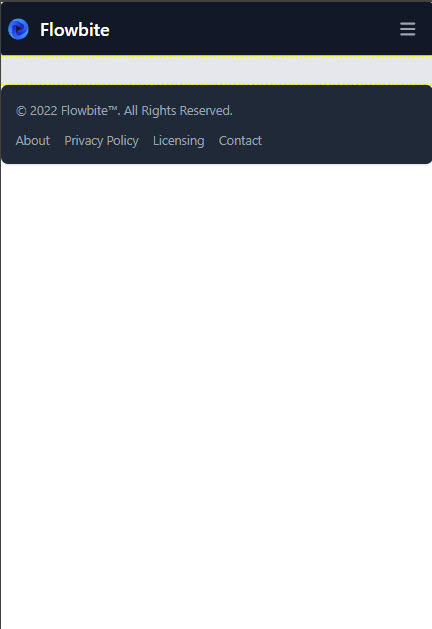
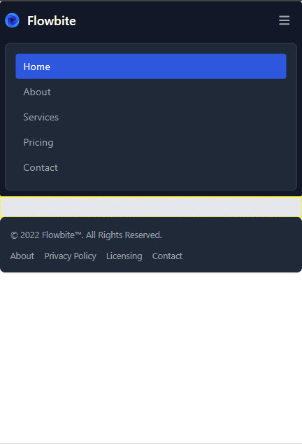

# Speed Build: A Classic WP Theme with Tailwind and Flowbite

As its name suggests this tutorial is going to be a speed build to get a classic WordPress Theme up and running as quickly as possible. To accomplish this we're going to make extensive use of VSCode to configure the project prior to opening it it Pinegrow. Once we've created our Pinegrow project and configured our WordPress settings we'll continue to make wide use of VSCode to speed up development.

The whole process shouldn't take more that 15 minutes and probably considerably less.

## Pre-requisites

There is an assumption that you are familiar with VSCode and the use of its Terminal.

It is assumed that you have Node.JS installed, It will help if you have the following VSCode Extensions installed.

1. Tailwind CSS Intellisense
2. Headwind
3. Pinegrow Live Sync
4. Live Server

Flowbite is a set of Tailwind pre-built components. The basic components are Free to use (subject to completing an online registration). These will be used to provide a simple header and footer section to our main index.php template.

Everything that is demonstrated here can be done Free of Charge (subject to your completing the Pinegrow parts with the constraints of your seven day trial).

If you've read the earlier tutorials;

1. [How to create a basic Tailwind site](basicsite.md)
2. [How to setup a Pinegrow Project from the basic tailwind site](pgbasictemplate.md)
3. [Creating a basic WordPress theme using Pinegrow](basicwordpress.md)

you'll know the basics of working with both VSCode and Pinegrow so to keep this to a reasonable length we'll omit the majority of illustration showing how to do things.

## Part 1: Configuration in VSCode

1. Create a new folder on your development machine and open it up in VSCode.
2. Open a Terminal window and execute the following command to create the package.json file.

```
npm init -y
```

3. Now execute the following command.

```
npm install -D tailwindcss@latest \
  @tailwindcss/typography@latest \
  @tailwindcss/forms@latest \
  postcss@latest \
  autoprefixer@latest \
  cssnano@latest \
  flowbite@latest
```

This will install Tailwind, Flowbite and a few other useful utilities.

4. Next up we'll need tailwind and postcss config files. Execute the following command.

```
npx tailwindcss init -p
```

5. Now create a new folder (named tailwind_theme) and in it create a new file called source.css.
6. Add the following code to the source.css file.

```css
@tailwind base;
@tailwind components;
@tailwind utilities;
```

7. Amend the tailwind.config.js file so that it looks like this

```js
/** @type {import('tailwindcss').Config} */
module.exports = {
  content: ["./*.{html,js}"],
  theme: {
    extend: {},
  },
  plugins: [
    require("@tailwindcss/typography"),
    require("@tailwindcss/forms"),
    require("flowbite/plugin"),
  ],
};
```

8. Amend the package.json file so that it looks like this

```json
{
  "name": "BaseClasicWp",
  "version": "1.0.0",
  "description": "",
  "main": "index.js",
  "scripts": {
    "dev": "npx tailwindcss -i ./tailwind_theme/source.css  -o ./tailwind_theme/tailwind.css  --watch",
    "build:css": "npx tailwindcss -i ./tailwind_theme/source.css  -o ./tailwind_theme/tailwind.css  --minify",
    "test": "echo \"Error: no test specified\" && exit 1"
  },
  "keywords": [],
  "author": "",
  "license": "ISC",
  "devDependencies": {
    "@tailwindcss/forms": "^0.5.3",
    "@tailwindcss/typography": "^0.5.7",
    "autoprefixer": "^10.4.13",
    "cssnano": "^5.1.14",
    "postcss": "^8.4.18",
    "tailwindcss": "^3.2.1"
  },
  "dependencies": {
    "flowbite": "^1.5.3"
  }
}
```

Just to clarify here we have added a dev script to create the taildind.css file during development. This will be a normally structured and formatted file.

For production we'll want to minify the css to save space, that is done with the build:ccs script.

9. Amend the postcss.config,js file so that it looks like this

```js
module.exports = {
  plugins: {
    tailwindcss: {},
    autoprefixer: {},
    ...(process.env.NODE_ENV === "production" ? { cssnano: {} } : {}),
  },
};
```

10. Create a new file called index.html.
11. In the file type the exclamation mark <kbd>!</kbd> followed by <kbd>Enter</kbd>. This will invoke Emmet and create a basic html file.
12. Add the following statement to the head section of the file.

```html
<link href="/tailwind_theme/tailwind.css" rel="stylesheet" />
```

13. At the command prompt execute the following.

```
npm run dev
```

You'll see a new tailwind.css created in the tailwind_theme folder.

## Part 2: Configure in Pinegrow

1. Ensure, if you've not already done so, that you have a local WordPress site configured.
2. Open Pinegrow and choose the Open file option.
3. Navigate to the index.htm file in the folder that you created in Part 1.
4. From the project panel in Pinegrow click the 'Open index.html as project' button.
5. Open the Design panel to configure Tailwind and set it up to use the external compiler.
6. Open the WordPress panel and click 'Activate WordPress'.
7. In the WordPress Theme Settings Dialog;

   1. Set Project type to theme
   2. Set your Theme Name.
   3. Set the theme slug (typically your theme name, all lowercase without spaces).
   4. Set the location of the theme folder (the themes folder in the local site you created).
   5. Ensure that index.html is set as the master page.
   6. Save the settings.

8. Amend the tailwind.config.js so that it now looks like this.

```js
/** @type {import('tailwindcss').Config} */
module.exports = {
  darkMode: "media", //<--This will trigger dark mode according to the user's settings
  content: [
    "./_pginfo/**/*.{html,js,css}",
    "./*.{html,js,css}",
    "./inc/**/*.{html,js,css}",
  ],
  theme: {
    extend: {
      colors: pg_colors, //<-- Use the pg_colors for colors
      fontFamily: pg_fonts, //<-- Use the pg_fonts for fonts
    },
  },
  plugins: [
    require("@tailwindcss/typography"),
    require("@tailwindcss/forms"),
    require("flowbite/plugin"),
  ],
};
```

9. Save all and the Export the WordPress theme.

## Part 3: Flowbite

The time has now come to configure the index.html page so that it will be able to act as the main catch all template in our WordPress theme. This time we'll use some pre-built components from [Flowbite](https://flowbite.com/docs/getting-started/introduction/). We'll be using a Navbar in the header and a Footer. One of the reasons for using these components is that they support Dark theming out of the box.

We'll be working in both VSCode and Pinegrow so make sure that you have to two properly synced. If you installed the Live Server Extension Open that up by clicking the 'Go Live' option.

1. In the index.html file open the body section ab nd then type header followed by enter. Emmet will create a `<header></header>` section.
2. On the Flowbite site navigate to the [Navbar Section](https://flowbite.com/docs/components/navbar/). We'll select the Default Navbar. Copy the Html.
3. Now open the `<header></header>` section and into that paste the html you just copied.
4. Immediately below the `<header></header>` section type the following: section>div.container.min-w-full.p-4.bg-gray-200 and then <kbd>Enter</kbd> this will create a section and nested div with some Tailwind classes added to the div. You will need to type the Emmet syntax for it to work.
5. Open the structure panel in Pinegrow, locate your new section and select it.
6. Switch to the WordPress panel add add the Site Content action.
7. On the Flowbite site navigate to the [Footer](https://flowbite.com/docs/components/footer/) section and copy the html for the Default footer.
8. Immediately below the `<section><section>` that you have just added paste the html that you have just copied.
9. We now need to add one last bit to our html to ensure that the Flowbite Navbar works as expected on mobile.
10. Immediately above the final `<body>` tag you will need to add a piece of html.

```html
<script src="../path/to/flowbite/dist/flowbite.js"></script>
```

Note that this script require the correct path to the flowbite.js to be set. If you've been following the instruction in this tutorial then your html line you add will be akin to this

```html
<script src="./node_modules/flowbite/dist/flowbite.js"></script>
```

If you've got this far without incident then you should have something like this;



if youu click the hamburger menu it will automatically display the mobile menu.



As my own development machine is set to Dark mode by default the Navbar and footer are dark.

There are a couple of small design issues to clear up. The Navbar and Footer both have rounded corners which look a little odd so lets remove them. They were created with the `rounded` class on the nav tag and the `rounded-lg` class on the footer tag. Remove them both.

We ought to esure that our section for site content respects Dark themes so remove the `bg-gray-200` class from the div tag and add instead `bg-white dark:bg-gray-800`.

Finally let's sort out the menus.

11. Locate the `<ul>` tag in the header and select it in the Pinegrow structure panel.
12. In the WordPress panel attach the Menu action to it and set the Location attribute to primary.
13. In the Footer comment out the entire `<ul>` tag so that no menu is shown there.

As you can see the Flowbite components are very easy to customise.

## Part 4: Finishing off

Now that we have our basic catch all done let's add the rest of the templates that we will need. As this is just a simple basic classic theme to act as a starter for other projects we'll keep the remaining templates as simple as possible to allow them to be more thoroughly customised when required in an actual project.

We will be able to do all of this in VSCode. Each template will start as an html file. There'll be no header or footer section as those will be provided by the master index.php.

We'll go through the first one in detail and then for the rest just provide the relevant names as the priciples of creation will be exactly the same.

### Single.html

1. Create a new file in the root called single.html.
2. Inside that file type <kbd>!</kbd> followed by <kbd>Enter</kbd> to invoke the basic html structure via Emmet.
3. Add the line to link the tailwind css to the haed section.

```html
<link href="/tailwind_theme/tailwind.css" rel="stylesheet" />
```

4. At the very fist html tag add the following within the html tag.

```html
wp-template wp-template-export-as="single.php"
wp-template-define-master-page="true"
```

5. Inside the body section add the following.

```html
<section class="min-w-full p-4 bg-white dark:bg-gray-800" wp-site-content>
  <div
    class="container p-4 mx-auto prose prose-lg bg-white dark:bg-gray-800"
    cms-post-content
  ></div>
</section>
```

The complete html for the template should look like this.

```html
<!DOCTYPE html>
<html
  lang="en"
  wp-template
  wp-template-export-as="single.php"
  wp-template-define-master-page="true"
>
  <head>
    <meta charset="UTF-8" />
    <meta http-equiv="X-UA-Compatible" content="IE=edge" />
    <meta name="viewport" content="width=device-width, initial-scale=1.0" />
    <link href="/tailwind_theme/tailwind.css" rel="stylesheet" />
    <title>Document</title>
  </head>
  <body>
    <section class="min-w-full p-4 bg-white dark:bg-gray-800" wp-site-content>
      <div
        class="container p-4 mx-auto prose prose-lg bg-white dark:bg-gray-800"
        cms-post-content
      ></div>
    </section>
  </body>
</html>
```

### Remaining Templates

According to the wordpress documentation we need templates for the following:

| Template name  | Purpose                                                                      |
| -------------- | ---------------------------------------------------------------------------- |
| index.php      | Main catch all (often includes footer and header)                            |
| header.php     | Used for the site header                                                     |
| footer.php     | Used for the site footer                                                     |
| single.php     | Used to display a single post                                                |
| page.php       | Used to display a single page                                                |
| front-page.php | Used to display the front page (if a static page is set for initial display) |
| home.php       | Used to Display the latest posts                                             |
| archive.php    | Used to display the general archive                                          |
| author.php     | Used to display posts by an author                                           |
| category.php   | Used to display posts by category                                            |
| tag.php        | Used to display posts by tag                                                 |
| taxonomy.php   | Used to display posts by taxonomy                                            |
| date.php       | Used to display posts by date                                                |
| search.php     | Used to return post and pages that meet search criteria                      |
| 404.php        | Used to show something if a page or post is not found                        |

Thus far we have covered the first four. You can now now do the following to quickly expedite the rest.

1. Copy the html above for the single template.
2. Create new html files in the root for each of the remaining templates needed (page.html etc)
3. Paste the html you copied into the file.
4. Alter the `html wp-template-export-as= ` line to reflect the relevant template name.
5. Save the file .

If Pinegrow is still open close the project, then reopen it and export the theme.

In VSCode now execute the following command

```
npm run build:css
```

That will minify the tailwind css file and reduce its size considerably. Return to Pinegrow and export the theme.

That concludes this tutorial. Obviously the published templates are really very basic and need to be fleshed out. You can see how that's done in a future tutorial where we'll look more closely at what Flowbite has to offer as well.

You can download this project from [Github](https://github.com/domsinclair/BaseClasicWp).
